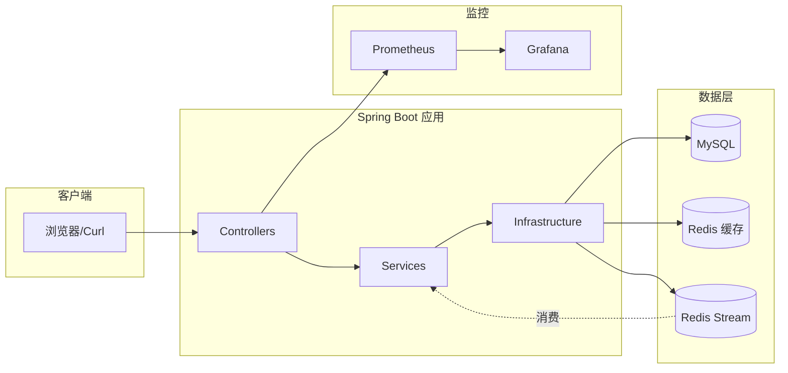

# ShortenURL 短链服务 实现计划

> **For agentic workers:** REQUIRED SUB-SKILL: Use superpowers:subagent-driven-development (recommended) or superpowers:executing-plans to implement this plan task-by-task. Steps use checkbox (`- [ ]`) syntax for tracking.

**Goal:** 在 21 天内构建一个 Java + Spring Boot 短链服务,具备 Redis 缓存、Redis Stream 异步统计、Bucket4j 限流、Docker Compose 编排、GitHub Actions CI、Prometheus + Grafana 监控的完整工程化体系,目标作为应届求职/实习简历项目。

**Architecture:** 单体 Spring Boot 应用 + MySQL(持久化)+ Redis(缓存 + Stream 消息队列),所有依赖通过 Docker Compose 一键启动。业务分四层:`controller` → `service` → `infrastructure` / `repository`,Controller 不写业务逻辑,Service 通过 infrastructure 层封装外部依赖。

**Tech Stack:** Java 17 · Spring Boot 3.2 · Spring Data JPA · Spring Data Redis · MySQL 8 · Redis 7 · Flyway · Bucket4j · Micrometer Prometheus · JUnit 5 · Mockito · Testcontainers · Docker · GitHub Actions · Prometheus · Grafana · wrk

---

## 总览

27 个任务,跨 3 周。每个任务自包含,可独立 commit。

| Phase | 任务范围 | 对应 spec 日程 |
|-------|---------|---------------|
| **Phase 0**: 项目骨架 | T01–T02 | D1 上半 |
| **Phase 1**: MySQL 持久化 | T03–T05 | D1 下半–D2 上半 |
| **Phase 2**: 短码生成 | T06–T08 | D2 下半–D3 上半 |
| **Phase 3**: 跳转 + 演示页 | T09–T11 | D3 下半–D4 |
| **Phase 4**: Redis 缓存 | T12–T14 | D5–D7 |
| **Phase 5**: Redis Stream + 统计 | T15–T17 | D8–D9 |
| **Phase 6**: 限流 | T18 | D10 |
| **Phase 7**: 容器化 | T19–T20 | D11–D12 |
| **Phase 8**: GitHub Actions CI | T21 | D13 |
| **Phase 9**: 监控大盘 | T22–T24 | D15–D16 |
| **Phase 10**: 压测 + 文档 | T25–T27 | D17–D20 |

每 Phase 末尾的 commit 形成一个里程碑 tag。

---

## 前置准备(开始 T01 前必做)

- [ ] 装 JDK 17(推荐 Eclipse Temurin):`java -version` 应显示 17.x
- [ ] 装 Maven 3.9+:`mvn -version`
- [ ] 装 Docker Desktop 并启动
- [ ] 装 IDE(推荐 IntelliJ IDEA Community)
- [ ] 在 GitHub 创建空仓库 `shorten-url`,clone 到本地
- [ ] 把项目根目录指定为 `C:/Users/hjy/Desktop/project_1/shorten-url`(后续所有文件路径相对此根)

---

# Phase 0 — 项目骨架

### Task T01:Maven 骨架 + Spring Boot 启动类

**Files:**
- Create: `pom.xml`
- Create: `src/main/java/com/yourname/shorten/ShortenApplication.java`
- Create: `src/main/resources/application.yml`
- Create: `.gitignore`

- [ ] **Step 1: 创建 `pom.xml`**

```xml
<?xml version="1.0" encoding="UTF-8"?>
<project xmlns="http://maven.apache.org/POM/4.0.0">
    <modelVersion>4.0.0</modelVersion>

    <parent>
        <groupId>org.springframework.boot</groupId>
        <artifactId>spring-boot-starter-parent</artifactId>
        <version>3.2.5</version>
        <relativePath/>
    </parent>

    <groupId>com.yourname</groupId>
    <artifactId>shorten-url</artifactId>
    <version>0.1.0</version>
    <name>shorten-url</name>
    <description>Resume-grade URL shortener with DevOps stack</description>

    <properties>
        <java.version>17</java.version>
    </properties>

    <dependencies>
        <dependency>
            <groupId>org.springframework.boot</groupId>
            <artifactId>spring-boot-starter-web</artifactId>
        </dependency>
        <dependency>
            <groupId>org.springframework.boot</groupId>
            <artifactId>spring-boot-starter-test</artifactId>
            <scope>test</scope>
        </dependency>
    </dependencies>

    <build>
        <plugins>
            <plugin>
                <groupId>org.springframework.boot</groupId>
                <artifactId>spring-boot-maven-plugin</artifactId>
            </plugin>
        </plugins>
    </build>
</project>
```

- [ ] **Step 2: 创建 `src/main/java/com/yourname/shorten/ShortenApplication.java`**

```java
package com.yourname.shorten;

import org.springframework.boot.SpringApplication;
import org.springframework.boot.autoconfigure.SpringBootApplication;

@SpringBootApplication
public class ShortenApplication {
    public static void main(String[] args) {
        SpringApplication.run(ShortenApplication.class, args);
    }
}
```

- [ ] **Step 3: 创建 `src/main/resources/application.yml`**

```yaml
server:
  port: 8080

spring:
  application:
    name: shorten-url
```

- [ ] **Step 4: 创建 `.gitignore`**

```
target/
.idea/
*.iml
.vscode/
*.log
.DS_Store
```

- [ ] **Step 5: 验证项目能编译并启动**

Run: `mvn clean compile`
Expected: `BUILD SUCCESS`

Run: `mvn spring-boot:run`
Expected: 输出含 `Started ShortenApplication in X seconds`,无报错。Ctrl+C 退出。

- [ ] **Step 6: Commit**

```bash
git add .
git commit -m "chore: Spring Boot 项目骨架"
```

---

### Task T02:Health Check 接口 + 第一个测试

验证测试框架配置正确;后续任务的 TDD 模板从这里开始稳定。

**Files:**
- Create: `src/main/java/com/yourname/shorten/controller/HealthController.java`
- Create: `src/test/java/com/yourname/shorten/controller/HealthControllerTest.java`

- [ ] **Step 1: 写失败测试 `HealthControllerTest.java`**

```java
package com.yourname.shorten.controller;

import org.junit.jupiter.api.Test;
import org.springframework.beans.factory.annotation.Autowired;
import org.springframework.boot.test.autoconfigure.web.servlet.WebMvcTest;
import org.springframework.test.web.servlet.MockMvc;

import static org.springframework.test.web.servlet.request.MockMvcRequestBuilders.get;
import static org.springframework.test.web.servlet.result.MockMvcResultMatchers.content;
import static org.springframework.test.web.servlet.result.MockMvcResultMatchers.status;

@WebMvcTest(HealthController.class)
class HealthControllerTest {

    @Autowired
    private MockMvc mockMvc;

    @Test
    void health_returnsOk() throws Exception {
        mockMvc.perform(get("/health"))
                .andExpect(status().isOk())
                .andExpect(content().string("OK"));
    }
}
```

- [ ] **Step 2: 跑测试看失败**

Run: `mvn test -Dtest=HealthControllerTest`
Expected: 失败,因为 `HealthController` 类不存在,出现 `cannot find symbol` 或类似编译错误。

- [ ] **Step 3: 写最小实现 `HealthController.java`**

```java
package com.yourname.shorten.controller;

import org.springframework.web.bind.annotation.GetMapping;
import org.springframework.web.bind.annotation.RestController;

@RestController
public class HealthController {

    @GetMapping("/health")
    public String health() {
        return "OK";
    }
}
```

- [ ] **Step 4: 跑测试看通过**

Run: `mvn test -Dtest=HealthControllerTest`
Expected: `Tests run: 1, Failures: 0, Errors: 0`

- [ ] **Step 5: Commit**

```bash
git add .
git commit -m "feat(health): GET /health 健康检查接口"
```

---

# Phase 1 — MySQL 持久化

### Task T03:加 MySQL 依赖 + Flyway migration 建表

**Files:**
- Modify: `pom.xml`(加 spring-data-jpa / mysql / flyway 依赖)
- Create: `src/main/resources/db/migration/V1__create_url_map.sql`
- Modify: `src/main/resources/application.yml`(加 datasource 配置)

- [ ] **Step 1: 在 `pom.xml` 的 `<dependencies>` 内追加**

```xml
<dependency>
    <groupId>org.springframework.boot</groupId>
    <artifactId>spring-boot-starter-data-jpa</artifactId>
</dependency>
<dependency>
    <groupId>com.mysql</groupId>
    <artifactId>mysql-connector-j</artifactId>
    <scope>runtime</scope>
</dependency>
<dependency>
    <groupId>org.flywaydb</groupId>
    <artifactId>flyway-core</artifactId>
</dependency>
<dependency>
    <groupId>org.flywaydb</groupId>
    <artifactId>flyway-mysql</artifactId>
</dependency>
```

- [ ] **Step 2: 创建 `src/main/resources/db/migration/V1__create_url_map.sql`**

```sql
CREATE TABLE url_map (
    id BIGINT AUTO_INCREMENT PRIMARY KEY,
    short_code VARCHAR(16) NULL,
    long_url VARCHAR(2048) NOT NULL,
    created_at DATETIME NOT NULL DEFAULT CURRENT_TIMESTAMP,
    expires_at DATETIME NULL,
    total_clicks BIGINT NOT NULL DEFAULT 0,
    UNIQUE KEY uk_short_code (short_code)
) ENGINE=InnoDB DEFAULT CHARSET=utf8mb4;
```

- [ ] **Step 3: 修改 `application.yml`**

```yaml
server:
  port: 8080

spring:
  application:
    name: shorten-url
  datasource:
    url: jdbc:mysql://localhost:3306/shorten?useSSL=false&serverTimezone=UTC&allowPublicKeyRetrieval=true
    username: shorten
    password: shorten
    driver-class-name: com.mysql.cj.jdbc.Driver
  jpa:
    hibernate:
      ddl-auto: validate
    properties:
      hibernate:
        dialect: org.hibernate.dialect.MySQL8Dialect
  flyway:
    enabled: true
    baseline-on-migrate: true
```

- [ ] **Step 4: 本地起一个临时 MySQL 用于开发**

Run:
```bash
docker run -d --name shorten-mysql-dev \
  -e MYSQL_ROOT_PASSWORD=root \
  -e MYSQL_DATABASE=shorten \
  -e MYSQL_USER=shorten \
  -e MYSQL_PASSWORD=shorten \
  -p 3306:3306 \
  mysql:8.0
```
Expected: 容器 ID 输出。等 10 秒待 MySQL 起好。

- [ ] **Step 5: 启动应用验证 migration 执行**

Run: `mvn spring-boot:run`
Expected: 日志含 `Successfully applied 1 migration to schema "shorten"`,无报错。Ctrl+C 退出。

- [ ] **Step 6: Commit**

```bash
git add .
git commit -m "feat(db): Flyway V1 建 url_map 表"
```

---

### Task T04:UrlMap 实体 + Repository

**Files:**
- Create: `src/main/java/com/yourname/shorten/repository/UrlMap.java`
- Create: `src/main/java/com/yourname/shorten/repository/UrlMapRepository.java`
- Create: `src/test/java/com/yourname/shorten/repository/UrlMapRepositoryTest.java`

- [ ] **Step 1: 写失败测试 `UrlMapRepositoryTest.java`**

```java
package com.yourname.shorten.repository;

import org.junit.jupiter.api.Test;
import org.springframework.beans.factory.annotation.Autowired;
import org.springframework.boot.test.autoconfigure.orm.jpa.DataJpaTest;
import org.springframework.boot.test.autoconfigure.jdbc.AutoConfigureTestDatabase;

import java.util.Optional;

import static org.assertj.core.api.Assertions.assertThat;
import static org.springframework.boot.test.autoconfigure.jdbc.AutoConfigureTestDatabase.Replace.NONE;

@DataJpaTest
@AutoConfigureTestDatabase(replace = NONE)
class UrlMapRepositoryTest {

    @Autowired
    private UrlMapRepository repository;

    @Test
    void save_and_findByShortCode() {
        UrlMap entity = new UrlMap();
        entity.setLongUrl("https://example.com/very/long/path");
        entity.setShortCode("aB3");
        UrlMap saved = repository.save(entity);

        assertThat(saved.getId()).isNotNull();
        Optional<UrlMap> found = repository.findByShortCode("aB3");
        assertThat(found).isPresent();
        assertThat(found.get().getLongUrl()).isEqualTo("https://example.com/very/long/path");
    }
}
```

- [ ] **Step 2: 跑测试看失败**

Run: `mvn test -Dtest=UrlMapRepositoryTest`
Expected: 编译失败(`UrlMap` / `UrlMapRepository` 不存在)。

- [ ] **Step 3: 创建实体 `UrlMap.java`**

```java
package com.yourname.shorten.repository;

import jakarta.persistence.*;
import java.time.LocalDateTime;

@Entity
@Table(name = "url_map")
public class UrlMap {

    @Id
    @GeneratedValue(strategy = GenerationType.IDENTITY)
    private Long id;

    @Column(name = "short_code", length = 16, unique = true)
    private String shortCode;

    @Column(name = "long_url", length = 2048, nullable = false)
    private String longUrl;

    @Column(name = "created_at", insertable = false, updatable = false)
    private LocalDateTime createdAt;

    @Column(name = "expires_at")
    private LocalDateTime expiresAt;

    @Column(name = "total_clicks", nullable = false)
    private long totalClicks = 0L;

    public Long getId() { return id; }
    public void setId(Long id) { this.id = id; }
    public String getShortCode() { return shortCode; }
    public void setShortCode(String shortCode) { this.shortCode = shortCode; }
    public String getLongUrl() { return longUrl; }
    public void setLongUrl(String longUrl) { this.longUrl = longUrl; }
    public LocalDateTime getCreatedAt() { return createdAt; }
    public LocalDateTime getExpiresAt() { return expiresAt; }
    public void setExpiresAt(LocalDateTime expiresAt) { this.expiresAt = expiresAt; }
    public long getTotalClicks() { return totalClicks; }
    public void setTotalClicks(long totalClicks) { this.totalClicks = totalClicks; }
}
```

- [ ] **Step 4: 创建 Repository `UrlMapRepository.java`**

```java
package com.yourname.shorten.repository;

import org.springframework.data.jpa.repository.JpaRepository;
import java.util.Optional;

public interface UrlMapRepository extends JpaRepository<UrlMap, Long> {
    Optional<UrlMap> findByShortCode(String shortCode);
}
```

- [ ] **Step 5: 跑测试看通过**

Run: `mvn test -Dtest=UrlMapRepositoryTest`
Expected: `Tests run: 1, Failures: 0`

- [ ] **Step 6: Commit**

```bash
git add .
git commit -m "feat(repo): UrlMap 实体 + Repository"
```

---

### Task T05:Testcontainers 集成测试基础设施

让集成测试用真 MySQL,行为不发散。

**Files:**
- Modify: `pom.xml`(加 Testcontainers 依赖)
- Create: `src/test/java/com/yourname/shorten/AbstractIntegrationTest.java`

- [ ] **Step 1: 在 `pom.xml` 的 `<dependencies>` 内追加**

```xml
<dependency>
    <groupId>org.testcontainers</groupId>
    <artifactId>junit-jupiter</artifactId>
    <version>1.19.7</version>
    <scope>test</scope>
</dependency>
<dependency>
    <groupId>org.testcontainers</groupId>
    <artifactId>mysql</artifactId>
    <version>1.19.7</version>
    <scope>test</scope>
</dependency>
```

- [ ] **Step 2: 创建抽象基类 `AbstractIntegrationTest.java`**

```java
package com.yourname.shorten;

import org.springframework.boot.test.context.SpringBootTest;
import org.springframework.test.context.DynamicPropertyRegistry;
import org.springframework.test.context.DynamicPropertySource;
import org.testcontainers.containers.MySQLContainer;
import org.testcontainers.junit.jupiter.Container;
import org.testcontainers.junit.jupiter.Testcontainers;

@SpringBootTest
@Testcontainers
public abstract class AbstractIntegrationTest {

    @Container
    static final MySQLContainer<?> MYSQL = new MySQLContainer<>("mysql:8.0")
            .withDatabaseName("shorten")
            .withUsername("shorten")
            .withPassword("shorten");

    @DynamicPropertySource
    static void registerProperties(DynamicPropertyRegistry registry) {
        registry.add("spring.datasource.url", MYSQL::getJdbcUrl);
        registry.add("spring.datasource.username", MYSQL::getUsername);
        registry.add("spring.datasource.password", MYSQL::getPassword);
    }
}
```

- [ ] **Step 3: 写一个 smoke test 验证基类工作 `src/test/java/com/yourname/shorten/SmokeIntegrationTest.java`**

```java
package com.yourname.shorten;

import com.yourname.shorten.repository.UrlMap;
import com.yourname.shorten.repository.UrlMapRepository;
import org.junit.jupiter.api.Test;
import org.springframework.beans.factory.annotation.Autowired;

import static org.assertj.core.api.Assertions.assertThat;

class SmokeIntegrationTest extends AbstractIntegrationTest {

    @Autowired
    private UrlMapRepository repository;

    @Test
    void persistsToRealMysql() {
        UrlMap entity = new UrlMap();
        entity.setLongUrl("https://example.com");
        entity.setShortCode("smoke");
        repository.save(entity);

        assertThat(repository.findByShortCode("smoke")).isPresent();
    }
}
```

- [ ] **Step 4: 跑集成测试**

Run: `mvn test -Dtest=SmokeIntegrationTest`
Expected: 自动拉 `mysql:8.0` 镜像、起容器、跑 Flyway、测试通过。`Tests run: 1, Failures: 0`(第一次会下载镜像,可能慢)

- [ ] **Step 5: Commit**

```bash
git add .
git commit -m "test: Testcontainers 集成测试基础设施"
```

---

# Phase 2 — 短码生成

### Task T06:Base62 编码器(纯函数,TDD 经典样本)

**Files:**
- Create: `src/main/java/com/yourname/shorten/infrastructure/Base62Encoder.java`
- Create: `src/test/java/com/yourname/shorten/infrastructure/Base62EncoderTest.java`

- [ ] **Step 1: 写失败测试 `Base62EncoderTest.java`**

```java
package com.yourname.shorten.infrastructure;

import org.junit.jupiter.api.Test;
import static org.assertj.core.api.Assertions.assertThat;

class Base62EncoderTest {

    @Test
    void encode_zero_returnsZero() {
        assertThat(Base62Encoder.encode(0L)).isEqualTo("0");
    }

    @Test
    void encode_one_returnsOne() {
        assertThat(Base62Encoder.encode(1L)).isEqualTo("1");
    }

    @Test
    void encode_ten_returnsA() {
        assertThat(Base62Encoder.encode(10L)).isEqualTo("a");
    }

    @Test
    void encode_thirtySix_returnsCapitalA() {
        assertThat(Base62Encoder.encode(36L)).isEqualTo("A");
    }

    @Test
    void encode_sixtyOne_returnsCapitalZ() {
        assertThat(Base62Encoder.encode(61L)).isEqualTo("Z");
    }

    @Test
    void encode_sixtyTwo_returnsTen() {
        assertThat(Base62Encoder.encode(62L)).isEqualTo("10");
    }

    @Test
    void encode_largeNumber_returnsCorrectString() {
        assertThat(Base62Encoder.encode(12345L)).isEqualTo("3D7");
    }

    @Test
    void encode_negative_throws() {
        org.junit.jupiter.api.Assertions.assertThrows(
                IllegalArgumentException.class,
                () -> Base62Encoder.encode(-1L)
        );
    }
}
```

- [ ] **Step 2: 跑测试看失败**

Run: `mvn test -Dtest=Base62EncoderTest`
Expected: 编译失败(`Base62Encoder` 类不存在)。

- [ ] **Step 3: 写实现 `Base62Encoder.java`**

```java
package com.yourname.shorten.infrastructure;

public final class Base62Encoder {

    private static final String ALPHABET =
            "0123456789abcdefghijklmnopqrstuvwxyzABCDEFGHIJKLMNOPQRSTUVWXYZ";
    private static final int BASE = ALPHABET.length();

    private Base62Encoder() {}

    public static String encode(long value) {
        if (value < 0) {
            throw new IllegalArgumentException("value must be non-negative, got " + value);
        }
        if (value == 0) {
            return "0";
        }
        StringBuilder sb = new StringBuilder();
        while (value > 0) {
            sb.append(ALPHABET.charAt((int) (value % BASE)));
            value /= BASE;
        }
        return sb.reverse().toString();
    }
}
```

- [ ] **Step 4: 跑测试看通过**

Run: `mvn test -Dtest=Base62EncoderTest`
Expected: `Tests run: 8, Failures: 0, Errors: 0`

- [ ] **Step 5: Commit**

```bash
git add .
git commit -m "feat(encoder): Base62 编码器 + 8 项单测"
```

---

### Task T07:ShortenService(生成短链业务逻辑)

**Files:**
- Create: `src/main/java/com/yourname/shorten/service/ShortenService.java`
- Create: `src/test/java/com/yourname/shorten/service/ShortenServiceTest.java`

- [ ] **Step 1: 写失败测试 `ShortenServiceTest.java`**

```java
package com.yourname.shorten.service;

import com.yourname.shorten.repository.UrlMap;
import com.yourname.shorten.repository.UrlMapRepository;
import org.junit.jupiter.api.Test;
import org.junit.jupiter.api.extension.ExtendWith;
import org.mockito.InjectMocks;
import org.mockito.Mock;
import org.mockito.junit.jupiter.MockitoExtension;

import static org.assertj.core.api.Assertions.assertThat;
import static org.mockito.ArgumentMatchers.any;
import static org.mockito.Mockito.*;

@ExtendWith(MockitoExtension.class)
class ShortenServiceTest {

    @Mock
    private UrlMapRepository repository;

    @InjectMocks
    private ShortenService service;

    @Test
    void shorten_returnsBase62EncodedId() {
        UrlMap saved = new UrlMap();
        saved.setId(12345L);
        saved.setLongUrl("https://example.com/long");
        when(repository.save(any(UrlMap.class))).thenReturn(saved);

        String shortCode = service.shorten("https://example.com/long");

        assertThat(shortCode).isEqualTo("3D7");
        verify(repository, times(2)).save(any(UrlMap.class));
    }
}
```

- [ ] **Step 2: 跑测试看失败**

Run: `mvn test -Dtest=ShortenServiceTest`
Expected: 编译失败(`ShortenService` 不存在)。

- [ ] **Step 3: 写实现 `ShortenService.java`**

```java
package com.yourname.shorten.service;

import com.yourname.shorten.infrastructure.Base62Encoder;
import com.yourname.shorten.repository.UrlMap;
import com.yourname.shorten.repository.UrlMapRepository;
import org.springframework.stereotype.Service;
import org.springframework.transaction.annotation.Transactional;

@Service
public class ShortenService {

    private final UrlMapRepository repository;

    public ShortenService(UrlMapRepository repository) {
        this.repository = repository;
    }

    @Transactional
    public String shorten(String longUrl) {
        UrlMap entity = new UrlMap();
        entity.setLongUrl(longUrl);
        UrlMap saved = repository.save(entity);
        String shortCode = Base62Encoder.encode(saved.getId());
        saved.setShortCode(shortCode);
        repository.save(saved);
        return shortCode;
    }
}
```

- [ ] **Step 4: 跑测试看通过**

Run: `mvn test -Dtest=ShortenServiceTest`
Expected: `Tests run: 1, Failures: 0`

- [ ] **Step 5: Commit**

```bash
git add .
git commit -m "feat(shorten): ShortenService 生成短码"
```

---

### Task T08:ShortenController + 端到端集成测试

**Files:**
- Create: `src/main/java/com/yourname/shorten/controller/ShortenController.java`
- Create: `src/main/java/com/yourname/shorten/controller/dto/ShortenRequest.java`
- Create: `src/main/java/com/yourname/shorten/controller/dto/ShortenResponse.java`
- Create: `src/test/java/com/yourname/shorten/controller/ShortenIntegrationTest.java`

- [ ] **Step 1: 写失败集成测试 `ShortenIntegrationTest.java`**

```java
package com.yourname.shorten.controller;

import com.yourname.shorten.AbstractIntegrationTest;
import org.junit.jupiter.api.Test;
import org.springframework.beans.factory.annotation.Autowired;
import org.springframework.boot.test.autoconfigure.web.servlet.AutoConfigureMockMvc;
import org.springframework.http.MediaType;
import org.springframework.test.web.servlet.MockMvc;

import static org.springframework.test.web.servlet.request.MockMvcRequestBuilders.post;
import static org.springframework.test.web.servlet.result.MockMvcResultMatchers.*;

@AutoConfigureMockMvc
class ShortenIntegrationTest extends AbstractIntegrationTest {

    @Autowired
    private MockMvc mockMvc;

    @Test
    void postShorten_returnsShortCode() throws Exception {
        mockMvc.perform(post("/api/shorten")
                .contentType(MediaType.APPLICATION_JSON)
                .content("{\"url\":\"https://example.com/very/long/path\"}"))
                .andExpect(status().isOk())
                .andExpect(jsonPath("$.shortCode").isNotEmpty())
                .andExpect(jsonPath("$.shortUrl").exists());
    }

    @Test
    void postShorten_emptyUrl_returns400() throws Exception {
        mockMvc.perform(post("/api/shorten")
                .contentType(MediaType.APPLICATION_JSON)
                .content("{\"url\":\"\"}"))
                .andExpect(status().isBadRequest());
    }
}
```

- [ ] **Step 2: 跑测试看失败**

Run: `mvn test -Dtest=ShortenIntegrationTest`
Expected: 编译失败或 404,因为 Controller 不存在。

- [ ] **Step 3: 创建 DTO `ShortenRequest.java`**

```java
package com.yourname.shorten.controller.dto;

import jakarta.validation.constraints.NotBlank;
import jakarta.validation.constraints.Size;

public class ShortenRequest {

    @NotBlank
    @Size(max = 2048)
    private String url;

    public String getUrl() { return url; }
    public void setUrl(String url) { this.url = url; }
}
```

- [ ] **Step 4: 创建 DTO `ShortenResponse.java`**

```java
package com.yourname.shorten.controller.dto;

public class ShortenResponse {

    private final String shortCode;
    private final String shortUrl;

    public ShortenResponse(String shortCode, String shortUrl) {
        this.shortCode = shortCode;
        this.shortUrl = shortUrl;
    }

    public String getShortCode() { return shortCode; }
    public String getShortUrl() { return shortUrl; }
}
```

- [ ] **Step 5: 在 `pom.xml` 加 validation 依赖**

```xml
<dependency>
    <groupId>org.springframework.boot</groupId>
    <artifactId>spring-boot-starter-validation</artifactId>
</dependency>
```

- [ ] **Step 6: 创建 `ShortenController.java`**

```java
package com.yourname.shorten.controller;

import com.yourname.shorten.controller.dto.ShortenRequest;
import com.yourname.shorten.controller.dto.ShortenResponse;
import com.yourname.shorten.service.ShortenService;
import jakarta.validation.Valid;
import org.springframework.beans.factory.annotation.Value;
import org.springframework.web.bind.annotation.*;

@RestController
@RequestMapping("/api/shorten")
public class ShortenController {

    private final ShortenService service;
    private final String publicBaseUrl;

    public ShortenController(ShortenService service,
                             @Value("${app.public-base-url:http://localhost:8080}") String publicBaseUrl) {
        this.service = service;
        this.publicBaseUrl = publicBaseUrl;
    }

    @PostMapping
    public ShortenResponse shorten(@Valid @RequestBody ShortenRequest request) {
        String code = service.shorten(request.getUrl());
        return new ShortenResponse(code, publicBaseUrl + "/" + code);
    }
}
```

- [ ] **Step 7: 跑测试看通过**

Run: `mvn test -Dtest=ShortenIntegrationTest`
Expected: `Tests run: 2, Failures: 0`

- [ ] **Step 8: Commit**

```bash
git add .
git commit -m "feat(api): POST /api/shorten 接口 + 校验 + 集成测试"
```

---

# Phase 3 — 跳转 + 演示页

### Task T09:RedirectService(纯 MySQL 版,未加缓存)

**Files:**
- Create: `src/main/java/com/yourname/shorten/service/RedirectService.java`
- Create: `src/test/java/com/yourname/shorten/service/RedirectServiceTest.java`

- [ ] **Step 1: 写失败测试 `RedirectServiceTest.java`**

```java
package com.yourname.shorten.service;

import com.yourname.shorten.repository.UrlMap;
import com.yourname.shorten.repository.UrlMapRepository;
import org.junit.jupiter.api.Test;
import org.junit.jupiter.api.extension.ExtendWith;
import org.mockito.InjectMocks;
import org.mockito.Mock;
import org.mockito.junit.jupiter.MockitoExtension;

import java.util.Optional;

import static org.assertj.core.api.Assertions.assertThat;
import static org.mockito.Mockito.when;

@ExtendWith(MockitoExtension.class)
class RedirectServiceTest {

    @Mock
    private UrlMapRepository repository;

    @InjectMocks
    private RedirectService service;

    @Test
    void resolve_existingShortCode_returnsLongUrl() {
        UrlMap entity = new UrlMap();
        entity.setShortCode("3D7");
        entity.setLongUrl("https://example.com");
        when(repository.findByShortCode("3D7")).thenReturn(Optional.of(entity));

        Optional<String> result = service.resolve("3D7");

        assertThat(result).contains("https://example.com");
    }

    @Test
    void resolve_unknownShortCode_returnsEmpty() {
        when(repository.findByShortCode("none")).thenReturn(Optional.empty());

        assertThat(service.resolve("none")).isEmpty();
    }
}
```

- [ ] **Step 2: 跑测试看失败**

Run: `mvn test -Dtest=RedirectServiceTest`
Expected: 编译失败(`RedirectService` 不存在)。

- [ ] **Step 3: 写实现 `RedirectService.java`**

```java
package com.yourname.shorten.service;

import com.yourname.shorten.repository.UrlMapRepository;
import org.springframework.stereotype.Service;

import java.util.Optional;

@Service
public class RedirectService {

    private final UrlMapRepository repository;

    public RedirectService(UrlMapRepository repository) {
        this.repository = repository;
    }

    public Optional<String> resolve(String shortCode) {
        return repository.findByShortCode(shortCode)
                .map(entity -> entity.getLongUrl());
    }
}
```

- [ ] **Step 4: 跑测试看通过**

Run: `mvn test -Dtest=RedirectServiceTest`
Expected: `Tests run: 2, Failures: 0`

- [ ] **Step 5: Commit**

```bash
git add .
git commit -m "feat(redirect): RedirectService 基础查询"
```

---

### Task T10:RedirectController(/{shortCode})

**Files:**
- Create: `src/main/java/com/yourname/shorten/controller/RedirectController.java`
- Create: `src/test/java/com/yourname/shorten/controller/RedirectIntegrationTest.java`

- [ ] **Step 1: 写失败集成测试 `RedirectIntegrationTest.java`**

```java
package com.yourname.shorten.controller;

import com.yourname.shorten.AbstractIntegrationTest;
import com.yourname.shorten.repository.UrlMap;
import com.yourname.shorten.repository.UrlMapRepository;
import org.junit.jupiter.api.Test;
import org.springframework.beans.factory.annotation.Autowired;
import org.springframework.boot.test.autoconfigure.web.servlet.AutoConfigureMockMvc;
import org.springframework.test.web.servlet.MockMvc;

import static org.springframework.test.web.servlet.request.MockMvcRequestBuilders.get;
import static org.springframework.test.web.servlet.result.MockMvcResultMatchers.*;

@AutoConfigureMockMvc
class RedirectIntegrationTest extends AbstractIntegrationTest {

    @Autowired
    private MockMvc mockMvc;

    @Autowired
    private UrlMapRepository repository;

    @Test
    void getRedirect_known_returns302() throws Exception {
        UrlMap entity = new UrlMap();
        entity.setShortCode("abc");
        entity.setLongUrl("https://example.com/target");
        repository.save(entity);

        mockMvc.perform(get("/abc"))
                .andExpect(status().isFound())
                .andExpect(header().string("Location", "https://example.com/target"));
    }

    @Test
    void getRedirect_unknown_returns404() throws Exception {
        mockMvc.perform(get("/nope"))
                .andExpect(status().isNotFound());
    }
}
```

- [ ] **Step 2: 跑测试看失败**

Run: `mvn test -Dtest=RedirectIntegrationTest`
Expected: 404(因为 Controller 不存在)。

- [ ] **Step 3: 创建 `RedirectController.java`**

```java
package com.yourname.shorten.controller;

import com.yourname.shorten.service.RedirectService;
import org.springframework.http.HttpHeaders;
import org.springframework.http.ResponseEntity;
import org.springframework.web.bind.annotation.GetMapping;
import org.springframework.web.bind.annotation.PathVariable;
import org.springframework.web.bind.annotation.RestController;

import java.net.URI;
import java.util.Optional;

@RestController
public class RedirectController {

    private final RedirectService service;

    public RedirectController(RedirectService service) {
        this.service = service;
    }

    @GetMapping("/{shortCode:[a-zA-Z0-9]+}")
    public ResponseEntity<Void> redirect(@PathVariable String shortCode) {
        Optional<String> target = service.resolve(shortCode);
        if (target.isEmpty()) {
            return ResponseEntity.notFound().build();
        }
        HttpHeaders headers = new HttpHeaders();
        headers.setLocation(URI.create(target.get()));
        return new ResponseEntity<>(headers, org.springframework.http.HttpStatus.FOUND);
    }
}
```

> `{shortCode:[a-zA-Z0-9]+}` 的正则约束防止与 `/health`、`/api/*`、静态资源路径冲突。

- [ ] **Step 4: 跑测试看通过**

Run: `mvn test -Dtest=RedirectIntegrationTest`
Expected: `Tests run: 2, Failures: 0`

- [ ] **Step 5: Commit**

```bash
git add .
git commit -m "feat(redirect): GET /{shortCode} 302 跳转接口"
```

---

### Task T11:一页演示 HTML

**Files:**
- Create: `src/main/resources/static/index.html`

- [ ] **Step 1: 创建演示页 `index.html`**

```html
<!DOCTYPE html>
<html lang="zh-CN">
<head>
    <meta charset="UTF-8">
    <title>ShortenURL</title>
    <style>
        body { font-family: -apple-system, sans-serif; max-width: 640px; margin: 60px auto; padding: 0 20px; }
        input { width: 100%; padding: 12px; font-size: 16px; border: 1px solid #ccc; border-radius: 4px; box-sizing: border-box; }
        button { margin-top: 12px; padding: 12px 24px; font-size: 16px; background: #2563eb; color: white; border: none; border-radius: 4px; cursor: pointer; }
        button:hover { background: #1d4ed8; }
        #result { margin-top: 24px; padding: 16px; background: #f3f4f6; border-radius: 4px; word-break: break-all; display: none; }
        #result a { color: #2563eb; text-decoration: none; }
    </style>
</head>
<body>
    <h1>ShortenURL</h1>
    <p>把长 URL 变短。</p>
    <input id="url" placeholder="https://example.com/long/path">
    <button onclick="submit()">生成短链</button>
    <div id="result"></div>

    <script>
        async function submit() {
            const url = document.getElementById('url').value.trim();
            if (!url) return;
            const resp = await fetch('/api/shorten', {
                method: 'POST',
                headers: { 'Content-Type': 'application/json' },
                body: JSON.stringify({ url })
            });
            const result = document.getElementById('result');
            if (!resp.ok) {
                result.innerHTML = '出错了:' + resp.status;
                result.style.display = 'block';
                return;
            }
            const data = await resp.json();
            result.innerHTML = '<strong>短链:</strong> <a href="' + data.shortUrl + '" target="_blank">' + data.shortUrl + '</a>';
            result.style.display = 'block';
        }
    </script>
</body>
</html>
```

- [ ] **Step 2: 启动应用手工验证**

Run: `mvn spring-boot:run`
浏览器打开 http://localhost:8080/index.html
Expected: 看到表单。输入 `https://www.baidu.com`,点"生成短链",页面显示短链。点短链跳到百度。
Ctrl+C 关掉应用。

- [ ] **Step 3: Commit**

```bash
git add .
git commit -m "feat(ui): 一页演示 HTML"
```

> **Phase 3 里程碑:** 此时整个"提交长链 → 拿短链 → 点击跳转"链路在纯 MySQL 上跑通。后续 Phase 4 把 Redis 缓存接进来。打个 tag:
> ```bash
> git tag milestone/phase-3-mysql-only
> ```

---

# Phase 4 — Redis 缓存

### Task T12:加 Redis 依赖 + 本地起 Redis + 缓存层封装

**Files:**
- Modify: `pom.xml`(加 spring-boot-starter-data-redis)
- Modify: `application.yml`(加 Redis 配置)
- Create: `src/main/java/com/yourname/shorten/infrastructure/UrlCache.java`
- Create: `src/test/java/com/yourname/shorten/infrastructure/UrlCacheTest.java`

- [ ] **Step 1: 在 `pom.xml` 加 Redis 依赖**

```xml
<dependency>
    <groupId>org.springframework.boot</groupId>
    <artifactId>spring-boot-starter-data-redis</artifactId>
</dependency>
<dependency>
    <groupId>org.testcontainers</groupId>
    <artifactId>testcontainers</artifactId>
    <version>1.19.7</version>
    <scope>test</scope>
</dependency>
```

- [ ] **Step 2: 修改 `application.yml` 加 Redis 配置**

在原 `spring:` 节点下追加:
```yaml
  data:
    redis:
      host: localhost
      port: 6379

app:
  public-base-url: http://localhost:8080
  cache:
    ttl-seconds: 86400
    ttl-jitter-seconds: 600
    null-ttl-seconds: 300
```

- [ ] **Step 3: 本地起 Redis**

Run:
```bash
docker run -d --name shorten-redis-dev -p 6379:6379 redis:7-alpine
```
Expected: 容器 ID。`docker ps` 应能看到。

- [ ] **Step 4: 修改 `AbstractIntegrationTest.java` 加 Redis 容器**

```java
package com.yourname.shorten;

import org.springframework.boot.test.context.SpringBootTest;
import org.springframework.test.context.DynamicPropertyRegistry;
import org.springframework.test.context.DynamicPropertySource;
import org.testcontainers.containers.GenericContainer;
import org.testcontainers.containers.MySQLContainer;
import org.testcontainers.junit.jupiter.Container;
import org.testcontainers.junit.jupiter.Testcontainers;

@SpringBootTest
@Testcontainers
public abstract class AbstractIntegrationTest {

    @Container
    static final MySQLContainer<?> MYSQL = new MySQLContainer<>("mysql:8.0")
            .withDatabaseName("shorten")
            .withUsername("shorten")
            .withPassword("shorten");

    @Container
    static final GenericContainer<?> REDIS = new GenericContainer<>("redis:7-alpine")
            .withExposedPorts(6379);

    @DynamicPropertySource
    static void registerProperties(DynamicPropertyRegistry registry) {
        registry.add("spring.datasource.url", MYSQL::getJdbcUrl);
        registry.add("spring.datasource.username", MYSQL::getUsername);
        registry.add("spring.datasource.password", MYSQL::getPassword);
        registry.add("spring.data.redis.host", REDIS::getHost);
        registry.add("spring.data.redis.port", () -> REDIS.getMappedPort(6379));
    }
}
```

- [ ] **Step 5: 写失败测试 `UrlCacheTest.java`**

```java
package com.yourname.shorten.infrastructure;

import com.yourname.shorten.AbstractIntegrationTest;
import org.junit.jupiter.api.Test;
import org.springframework.beans.factory.annotation.Autowired;

import java.util.Optional;

import static org.assertj.core.api.Assertions.assertThat;

class UrlCacheTest extends AbstractIntegrationTest {

    @Autowired
    private UrlCache cache;

    @Test
    void putAndGet_returnsValue() {
        cache.put("abc", "https://example.com");
        assertThat(cache.get("abc")).contains("https://example.com");
    }

    @Test
    void get_miss_returnsEmpty() {
        assertThat(cache.get("missing")).isEmpty();
    }

    @Test
    void putNull_marksAsKnownMissing() {
        cache.putNull("ghost");
        assertThat(cache.isKnownMissing("ghost")).isTrue();
        assertThat(cache.get("ghost")).isEmpty();
    }
}
```

- [ ] **Step 6: 跑测试看失败**

Run: `mvn test -Dtest=UrlCacheTest`
Expected: 编译失败(`UrlCache` 不存在)。

- [ ] **Step 7: 创建 `UrlCache.java`**

```java
package com.yourname.shorten.infrastructure;

import org.springframework.beans.factory.annotation.Value;
import org.springframework.data.redis.core.StringRedisTemplate;
import org.springframework.stereotype.Component;

import java.time.Duration;
import java.util.Optional;
import java.util.concurrent.ThreadLocalRandom;

@Component
public class UrlCache {

    private static final String URL_KEY = "url:";
    private static final String NULL_KEY = "null:";

    private final StringRedisTemplate redis;
    private final long ttlSeconds;
    private final long jitterSeconds;
    private final long nullTtlSeconds;

    public UrlCache(StringRedisTemplate redis,
                    @Value("${app.cache.ttl-seconds}") long ttlSeconds,
                    @Value("${app.cache.ttl-jitter-seconds}") long jitterSeconds,
                    @Value("${app.cache.null-ttl-seconds}") long nullTtlSeconds) {
        this.redis = redis;
        this.ttlSeconds = ttlSeconds;
        this.jitterSeconds = jitterSeconds;
        this.nullTtlSeconds = nullTtlSeconds;
    }

    public Optional<String> get(String shortCode) {
        return Optional.ofNullable(redis.opsForValue().get(URL_KEY + shortCode));
    }

    public void put(String shortCode, String longUrl) {
        long jitter = jitterSeconds == 0 ? 0 : ThreadLocalRandom.current().nextLong(0, jitterSeconds);
        redis.opsForValue().set(URL_KEY + shortCode, longUrl, Duration.ofSeconds(ttlSeconds + jitter));
    }

    public void putNull(String shortCode) {
        redis.opsForValue().set(NULL_KEY + shortCode, "1", Duration.ofSeconds(nullTtlSeconds));
    }

    public boolean isKnownMissing(String shortCode) {
        return Boolean.TRUE.equals(redis.hasKey(NULL_KEY + shortCode));
    }
}
```

- [ ] **Step 8: 跑测试看通过**

Run: `mvn test -Dtest=UrlCacheTest`
Expected: `Tests run: 3, Failures: 0`(第一次会拉 redis:7-alpine 镜像)

- [ ] **Step 9: Commit**

```bash
git add .
git commit -m "feat(cache): UrlCache 封装 Redis,支持空值缓存与 TTL 抖动"
```

---

### Task T13:RedirectService 接入缓存(Cache-Aside)

**Files:**
- Modify: `src/main/java/com/yourname/shorten/service/RedirectService.java`
- Modify: `src/test/java/com/yourname/shorten/service/RedirectServiceTest.java`(扩充测试)

- [ ] **Step 1: 在 `RedirectServiceTest.java` 加新测试**

替换原文件内容为:

```java
package com.yourname.shorten.service;

import com.yourname.shorten.infrastructure.UrlCache;
import com.yourname.shorten.repository.UrlMap;
import com.yourname.shorten.repository.UrlMapRepository;
import org.junit.jupiter.api.Test;
import org.junit.jupiter.api.extension.ExtendWith;
import org.mockito.InjectMocks;
import org.mockito.Mock;
import org.mockito.junit.jupiter.MockitoExtension;

import java.util.Optional;

import static org.assertj.core.api.Assertions.assertThat;
import static org.mockito.Mockito.*;

@ExtendWith(MockitoExtension.class)
class RedirectServiceTest {

    @Mock
    private UrlMapRepository repository;

    @Mock
    private UrlCache cache;

    @InjectMocks
    private RedirectService service;

    @Test
    void resolve_cacheHit_doesNotQueryDb() {
        when(cache.isKnownMissing("hot")).thenReturn(false);
        when(cache.get("hot")).thenReturn(Optional.of("https://hot.example.com"));

        Optional<String> result = service.resolve("hot");

        assertThat(result).contains("https://hot.example.com");
        verifyNoInteractions(repository);
    }

    @Test
    void resolve_knownMissing_doesNotQueryDb() {
        when(cache.isKnownMissing("ghost")).thenReturn(true);

        assertThat(service.resolve("ghost")).isEmpty();
        verifyNoInteractions(repository);
    }

    @Test
    void resolve_cacheMiss_loadsFromDbAndWarmsCache() {
        UrlMap entity = new UrlMap();
        entity.setShortCode("cold");
        entity.setLongUrl("https://cold.example.com");
        when(cache.isKnownMissing("cold")).thenReturn(false);
        when(cache.get("cold")).thenReturn(Optional.empty());
        when(repository.findByShortCode("cold")).thenReturn(Optional.of(entity));

        Optional<String> result = service.resolve("cold");

        assertThat(result).contains("https://cold.example.com");
        verify(cache).put("cold", "https://cold.example.com");
    }

    @Test
    void resolve_dbMiss_marksKnownMissing() {
        when(cache.isKnownMissing("nope")).thenReturn(false);
        when(cache.get("nope")).thenReturn(Optional.empty());
        when(repository.findByShortCode("nope")).thenReturn(Optional.empty());

        assertThat(service.resolve("nope")).isEmpty();
        verify(cache).putNull("nope");
    }
}
```

- [ ] **Step 2: 跑测试看失败**

Run: `mvn test -Dtest=RedirectServiceTest`
Expected: 编译失败或 NullPointer,因为 Service 还没用 cache。

- [ ] **Step 3: 修改 `RedirectService.java`**

```java
package com.yourname.shorten.service;

import com.yourname.shorten.infrastructure.UrlCache;
import com.yourname.shorten.repository.UrlMapRepository;
import org.springframework.stereotype.Service;

import java.util.Optional;

@Service
public class RedirectService {

    private final UrlMapRepository repository;
    private final UrlCache cache;

    public RedirectService(UrlMapRepository repository, UrlCache cache) {
        this.repository = repository;
        this.cache = cache;
    }

    public Optional<String> resolve(String shortCode) {
        if (cache.isKnownMissing(shortCode)) {
            return Optional.empty();
        }
        Optional<String> cached = cache.get(shortCode);
        if (cached.isPresent()) {
            return cached;
        }
        Optional<String> loaded = repository.findByShortCode(shortCode)
                .map(entity -> entity.getLongUrl());
        if (loaded.isPresent()) {
            cache.put(shortCode, loaded.get());
        } else {
            cache.putNull(shortCode);
        }
        return loaded;
    }
}
```

- [ ] **Step 4: 跑测试看通过**

Run: `mvn test -Dtest=RedirectServiceTest`
Expected: `Tests run: 4, Failures: 0`

- [ ] **Step 5: Commit**

```bash
git add .
git commit -m "feat(redirect): RedirectService 接入 Cache-Aside + 空值缓存"
```

---

### Task T14:ShortenService 预热缓存

生成短链时把映射顺手写进缓存,首次跳转就命中。

**Files:**
- Modify: `src/main/java/com/yourname/shorten/service/ShortenService.java`
- Modify: `src/test/java/com/yourname/shorten/service/ShortenServiceTest.java`

- [ ] **Step 1: 替换 `ShortenServiceTest.java`**

```java
package com.yourname.shorten.service;

import com.yourname.shorten.infrastructure.UrlCache;
import com.yourname.shorten.repository.UrlMap;
import com.yourname.shorten.repository.UrlMapRepository;
import org.junit.jupiter.api.Test;
import org.junit.jupiter.api.extension.ExtendWith;
import org.mockito.InjectMocks;
import org.mockito.Mock;
import org.mockito.junit.jupiter.MockitoExtension;

import static org.assertj.core.api.Assertions.assertThat;
import static org.mockito.ArgumentMatchers.any;
import static org.mockito.Mockito.*;

@ExtendWith(MockitoExtension.class)
class ShortenServiceTest {

    @Mock
    private UrlMapRepository repository;

    @Mock
    private UrlCache cache;

    @InjectMocks
    private ShortenService service;

    @Test
    void shorten_returnsBase62EncodedId_andWarmsCache() {
        UrlMap saved = new UrlMap();
        saved.setId(12345L);
        saved.setLongUrl("https://example.com/long");
        when(repository.save(any(UrlMap.class))).thenReturn(saved);

        String shortCode = service.shorten("https://example.com/long");

        assertThat(shortCode).isEqualTo("3D7");
        verify(cache).put("3D7", "https://example.com/long");
    }
}
```

- [ ] **Step 2: 跑测试看失败**

Run: `mvn test -Dtest=ShortenServiceTest`
Expected: 编译失败(Service 构造器签名变了)或 verify 失败。

- [ ] **Step 3: 修改 `ShortenService.java`**

```java
package com.yourname.shorten.service;

import com.yourname.shorten.infrastructure.Base62Encoder;
import com.yourname.shorten.infrastructure.UrlCache;
import com.yourname.shorten.repository.UrlMap;
import com.yourname.shorten.repository.UrlMapRepository;
import org.springframework.stereotype.Service;
import org.springframework.transaction.annotation.Transactional;

@Service
public class ShortenService {

    private final UrlMapRepository repository;
    private final UrlCache cache;

    public ShortenService(UrlMapRepository repository, UrlCache cache) {
        this.repository = repository;
        this.cache = cache;
    }

    @Transactional
    public String shorten(String longUrl) {
        UrlMap entity = new UrlMap();
        entity.setLongUrl(longUrl);
        UrlMap saved = repository.save(entity);
        String shortCode = Base62Encoder.encode(saved.getId());
        saved.setShortCode(shortCode);
        repository.save(saved);
        cache.put(shortCode, longUrl);
        return shortCode;
    }
}
```

- [ ] **Step 4: 跑测试看通过**

Run: `mvn test -Dtest=ShortenServiceTest`
Expected: `Tests run: 1, Failures: 0`

- [ ] **Step 5: 跑全量测试确保没破坏其他**

Run: `mvn test`
Expected: 所有测试通过。

- [ ] **Step 6: Commit**

```bash
git add .
git commit -m "feat(shorten): 生成时预热 Redis 缓存"
```

> **Phase 4 里程碑:**
> ```bash
> git tag milestone/phase-4-cache
> ```

---

# Phase 5 — Redis Stream + 异步统计

### Task T15:ClickEventProducer(投递访问事件)

**Files:**
- Create: `src/main/java/com/yourname/shorten/infrastructure/ClickEventProducer.java`
- Create: `src/test/java/com/yourname/shorten/infrastructure/ClickEventProducerTest.java`

- [ ] **Step 1: 写失败测试 `ClickEventProducerTest.java`**

```java
package com.yourname.shorten.infrastructure;

import com.yourname.shorten.AbstractIntegrationTest;
import org.junit.jupiter.api.Test;
import org.springframework.beans.factory.annotation.Autowired;
import org.springframework.data.redis.connection.stream.MapRecord;
import org.springframework.data.redis.connection.stream.StreamReadOptions;
import org.springframework.data.redis.connection.stream.StreamOffset;
import org.springframework.data.redis.core.StringRedisTemplate;

import java.util.List;

import static org.assertj.core.api.Assertions.assertThat;

class ClickEventProducerTest extends AbstractIntegrationTest {

    @Autowired
    private ClickEventProducer producer;

    @Autowired
    private StringRedisTemplate redis;

    @Test
    void publish_appendsToStream() {
        producer.publish("abc");

        List<MapRecord<String, Object, Object>> records = redis.opsForStream()
                .read(StreamReadOptions.empty().count(10),
                      StreamOffset.fromStart("clicks-stream"));

        assertThat(records).isNotNull();
        assertThat(records.stream().anyMatch(r -> "abc".equals(r.getValue().get("shortCode")))).isTrue();
    }
}
```

- [ ] **Step 2: 跑测试看失败**

Run: `mvn test -Dtest=ClickEventProducerTest`
Expected: 编译失败(`ClickEventProducer` 不存在)。

- [ ] **Step 3: 创建 `ClickEventProducer.java`**

```java
package com.yourname.shorten.infrastructure;

import org.springframework.data.redis.connection.stream.ObjectRecord;
import org.springframework.data.redis.connection.stream.StreamRecords;
import org.springframework.data.redis.core.StringRedisTemplate;
import org.springframework.stereotype.Component;

import java.util.Map;

@Component
public class ClickEventProducer {

    public static final String STREAM_KEY = "clicks-stream";

    private final StringRedisTemplate redis;

    public ClickEventProducer(StringRedisTemplate redis) {
        this.redis = redis;
    }

    public void publish(String shortCode) {
        redis.opsForStream().add(
                StreamRecords.mapBacked(Map.of(
                        "shortCode", shortCode,
                        "ts", String.valueOf(System.currentTimeMillis())
                )).withStreamKey(STREAM_KEY)
        );
    }
}
```

- [ ] **Step 4: 跑测试看通过**

Run: `mvn test -Dtest=ClickEventProducerTest`
Expected: `Tests run: 1, Failures: 0`

- [ ] **Step 5: Commit**

```bash
git add .
git commit -m "feat(stream): ClickEventProducer 投递访问事件"
```

---

### Task T16:RedirectController 触发投递 + 不阻塞响应

**Files:**
- Modify: `src/main/java/com/yourname/shorten/controller/RedirectController.java`
- Modify: `src/test/java/com/yourname/shorten/controller/RedirectIntegrationTest.java`

- [ ] **Step 1: 扩充测试 `RedirectIntegrationTest.java`**

```java
package com.yourname.shorten.controller;

import com.yourname.shorten.AbstractIntegrationTest;
import com.yourname.shorten.infrastructure.ClickEventProducer;
import com.yourname.shorten.repository.UrlMap;
import com.yourname.shorten.repository.UrlMapRepository;
import org.junit.jupiter.api.Test;
import org.springframework.beans.factory.annotation.Autowired;
import org.springframework.boot.test.autoconfigure.web.servlet.AutoConfigureMockMvc;
import org.springframework.data.redis.connection.stream.StreamOffset;
import org.springframework.data.redis.connection.stream.StreamReadOptions;
import org.springframework.data.redis.core.StringRedisTemplate;
import org.springframework.test.web.servlet.MockMvc;

import static org.assertj.core.api.Assertions.assertThat;
import static org.springframework.test.web.servlet.request.MockMvcRequestBuilders.get;
import static org.springframework.test.web.servlet.result.MockMvcResultMatchers.*;

@AutoConfigureMockMvc
class RedirectIntegrationTest extends AbstractIntegrationTest {

    @Autowired
    private MockMvc mockMvc;
    @Autowired
    private UrlMapRepository repository;
    @Autowired
    private StringRedisTemplate redis;

    @Test
    void getRedirect_known_returns302() throws Exception {
        UrlMap entity = new UrlMap();
        entity.setShortCode("abc");
        entity.setLongUrl("https://example.com/target");
        repository.save(entity);

        mockMvc.perform(get("/abc"))
                .andExpect(status().isFound())
                .andExpect(header().string("Location", "https://example.com/target"));
    }

    @Test
    void getRedirect_unknown_returns404() throws Exception {
        mockMvc.perform(get("/nope"))
                .andExpect(status().isNotFound());
    }

    @Test
    void getRedirect_known_publishesClickEvent() throws Exception {
        UrlMap entity = new UrlMap();
        entity.setShortCode("ev1");
        entity.setLongUrl("https://example.com/e");
        repository.save(entity);

        mockMvc.perform(get("/ev1")).andExpect(status().isFound());

        Thread.sleep(200);
        Long length = redis.opsForStream().size(ClickEventProducer.STREAM_KEY);
        assertThat(length).isGreaterThan(0L);
    }
}
```

- [ ] **Step 2: 跑测试看失败**

Run: `mvn test -Dtest=RedirectIntegrationTest`
Expected: `getRedirect_known_publishesClickEvent` 失败,因为 Controller 还没投递。

- [ ] **Step 3: 修改 `RedirectController.java`**

```java
package com.yourname.shorten.controller;

import com.yourname.shorten.infrastructure.ClickEventProducer;
import com.yourname.shorten.service.RedirectService;
import org.springframework.http.HttpHeaders;
import org.springframework.http.HttpStatus;
import org.springframework.http.ResponseEntity;
import org.springframework.web.bind.annotation.GetMapping;
import org.springframework.web.bind.annotation.PathVariable;
import org.springframework.web.bind.annotation.RestController;

import java.net.URI;
import java.util.Optional;
import java.util.concurrent.CompletableFuture;

@RestController
public class RedirectController {

    private final RedirectService service;
    private final ClickEventProducer producer;

    public RedirectController(RedirectService service, ClickEventProducer producer) {
        this.service = service;
        this.producer = producer;
    }

    @GetMapping("/{shortCode:[a-zA-Z0-9]+}")
    public ResponseEntity<Void> redirect(@PathVariable String shortCode) {
        Optional<String> target = service.resolve(shortCode);
        if (target.isEmpty()) {
            return ResponseEntity.notFound().build();
        }
        // 异步投递,不阻塞主链路
        CompletableFuture.runAsync(() -> producer.publish(shortCode));

        HttpHeaders headers = new HttpHeaders();
        headers.setLocation(URI.create(target.get()));
        return new ResponseEntity<>(headers, HttpStatus.FOUND);
    }
}
```

- [ ] **Step 4: 跑测试看通过**

Run: `mvn test -Dtest=RedirectIntegrationTest`
Expected: `Tests run: 3, Failures: 0`

- [ ] **Step 5: Commit**

```bash
git add .
git commit -m "feat(redirect): 异步投递访问事件,不阻塞 302"
```

---

### Task T17:StatsWorker + StatsCounter + 统计接口

**Files:**
- Create: `src/main/java/com/yourname/shorten/infrastructure/StatsCounter.java`
- Create: `src/main/java/com/yourname/shorten/service/StatsWorker.java`
- Create: `src/main/java/com/yourname/shorten/controller/StatsController.java`
- Modify: `src/main/java/com/yourname/shorten/ShortenApplication.java`(加 `@EnableScheduling`)
- Create: `src/test/java/com/yourname/shorten/service/StatsWorkerTest.java`

- [ ] **Step 1: 修改 `ShortenApplication.java` 启用调度**

```java
package com.yourname.shorten;

import org.springframework.boot.SpringApplication;
import org.springframework.boot.autoconfigure.SpringBootApplication;
import org.springframework.scheduling.annotation.EnableScheduling;

@SpringBootApplication
@EnableScheduling
public class ShortenApplication {
    public static void main(String[] args) {
        SpringApplication.run(ShortenApplication.class, args);
    }
}
```

- [ ] **Step 2: 创建 `StatsCounter.java`**

```java
package com.yourname.shorten.infrastructure;

import org.springframework.data.redis.core.StringRedisTemplate;
import org.springframework.stereotype.Component;

import java.time.Duration;
import java.time.LocalDate;
import java.time.format.DateTimeFormatter;
import java.util.List;
import java.util.stream.Collectors;

@Component
public class StatsCounter {

    private static final DateTimeFormatter DAY_FMT = DateTimeFormatter.ofPattern("yyyyMMdd");

    private final StringRedisTemplate redis;

    public StatsCounter(StringRedisTemplate redis) {
        this.redis = redis;
    }

    public void increment(String shortCode) {
        redis.opsForValue().increment(totalKey(shortCode));
        String dayKey = dayKey(shortCode, LocalDate.now());
        redis.opsForValue().increment(dayKey);
        redis.expire(dayKey, Duration.ofDays(30));
    }

    public long getTotal(String shortCode) {
        String value = redis.opsForValue().get(totalKey(shortCode));
        return value == null ? 0L : Long.parseLong(value);
    }

    public List<DayCount> last7Days(String shortCode) {
        LocalDate today = LocalDate.now();
        return java.util.stream.IntStream.range(0, 7)
                .mapToObj(i -> today.minusDays(i))
                .map(d -> {
                    String value = redis.opsForValue().get(dayKey(shortCode, d));
                    return new DayCount(d.format(DAY_FMT), value == null ? 0L : Long.parseLong(value));
                })
                .collect(Collectors.toList());
    }

    private String totalKey(String shortCode) {
        return "stats:" + shortCode;
    }

    private String dayKey(String shortCode, LocalDate day) {
        return "stats:" + shortCode + ":day:" + day.format(DAY_FMT);
    }

    public record DayCount(String date, long clicks) {}
}
```

- [ ] **Step 3: 创建 `StatsWorker.java`**

```java
package com.yourname.shorten.service;

import com.yourname.shorten.infrastructure.ClickEventProducer;
import com.yourname.shorten.infrastructure.StatsCounter;
import org.springframework.data.redis.connection.stream.*;
import org.springframework.data.redis.core.StringRedisTemplate;
import org.springframework.data.redis.connection.RedisConnectionFactory;
import org.springframework.scheduling.annotation.Scheduled;
import org.springframework.stereotype.Component;
import jakarta.annotation.PostConstruct;
import org.slf4j.Logger;
import org.slf4j.LoggerFactory;

import java.time.Duration;
import java.util.List;

@Component
public class StatsWorker {

    private static final Logger log = LoggerFactory.getLogger(StatsWorker.class);
    private static final String GROUP = "stats-worker";
    private static final String CONSUMER = "consumer-1";

    private final StringRedisTemplate redis;
    private final StatsCounter counter;

    public StatsWorker(StringRedisTemplate redis, StatsCounter counter) {
        this.redis = redis;
        this.counter = counter;
    }

    @PostConstruct
    void ensureGroup() {
        try {
            redis.opsForStream().createGroup(ClickEventProducer.STREAM_KEY, ReadOffset.from("0"), GROUP);
        } catch (Exception ignored) {
            // group 已存在则忽略
        }
    }

    @Scheduled(fixedDelay = 1000)
    void consume() {
        List<MapRecord<String, Object, Object>> records = redis.opsForStream().read(
                Consumer.from(GROUP, CONSUMER),
                StreamReadOptions.empty().count(100).block(Duration.ofMillis(100)),
                StreamOffset.create(ClickEventProducer.STREAM_KEY, ReadOffset.lastConsumed())
        );
        if (records == null || records.isEmpty()) {
            return;
        }
        for (MapRecord<String, Object, Object> record : records) {
            Object code = record.getValue().get("shortCode");
            if (code != null) {
                counter.increment(code.toString());
            }
            redis.opsForStream().acknowledge(ClickEventProducer.STREAM_KEY, GROUP, record.getId());
        }
    }
}
```

- [ ] **Step 4: 创建 `StatsController.java`**

```java
package com.yourname.shorten.controller;

import com.yourname.shorten.infrastructure.StatsCounter;
import org.springframework.web.bind.annotation.GetMapping;
import org.springframework.web.bind.annotation.PathVariable;
import org.springframework.web.bind.annotation.RequestMapping;
import org.springframework.web.bind.annotation.RestController;

import java.util.List;
import java.util.Map;

@RestController
@RequestMapping("/api/stats")
public class StatsController {

    private final StatsCounter counter;

    public StatsController(StatsCounter counter) {
        this.counter = counter;
    }

    @GetMapping("/{shortCode}")
    public Map<String, Object> stats(@PathVariable String shortCode) {
        long total = counter.getTotal(shortCode);
        List<StatsCounter.DayCount> last7 = counter.last7Days(shortCode);
        return Map.of(
                "shortCode", shortCode,
                "totalClicks", total,
                "last7Days", last7
        );
    }
}
```

- [ ] **Step 5: 写集成测试 `StatsWorkerTest.java`**

```java
package com.yourname.shorten.service;

import com.yourname.shorten.AbstractIntegrationTest;
import com.yourname.shorten.infrastructure.ClickEventProducer;
import com.yourname.shorten.infrastructure.StatsCounter;
import org.awaitility.Awaitility;
import org.junit.jupiter.api.Test;
import org.springframework.beans.factory.annotation.Autowired;

import java.time.Duration;

import static org.assertj.core.api.Assertions.assertThat;

class StatsWorkerTest extends AbstractIntegrationTest {

    @Autowired
    private ClickEventProducer producer;

    @Autowired
    private StatsCounter counter;

    @Test
    void worker_consumesEvents_andIncrementsCounter() {
        producer.publish("workertest");
        producer.publish("workertest");
        producer.publish("workertest");

        Awaitility.await()
                .atMost(Duration.ofSeconds(5))
                .untilAsserted(() -> assertThat(counter.getTotal("workertest")).isGreaterThanOrEqualTo(3L));
    }
}
```

- [ ] **Step 6: 在 `pom.xml` 加 awaitility 依赖**

```xml
<dependency>
    <groupId>org.awaitility</groupId>
    <artifactId>awaitility</artifactId>
    <scope>test</scope>
</dependency>
```

- [ ] **Step 7: 跑测试看通过**

Run: `mvn test -Dtest=StatsWorkerTest`
Expected: `Tests run: 1, Failures: 0`(Worker 在 5 秒内消费完事件)

- [ ] **Step 8: 跑全量测试**

Run: `mvn test`
Expected: 所有测试通过。

- [ ] **Step 9: Commit**

```bash
git add .
git commit -m "feat(stats): StatsWorker 消费 Stream + GET /api/stats/{code} 接口"
```

---

### Task T17b:计数器定时回写 MySQL `total_clicks`

实现 spec 6.3 步骤 4:每 60 秒把 Redis 累计计数同步到 MySQL,降低 DB 写压力。Redis 仍是读路径的真实源,DB 字段供"备灾 / 离线分析"用。

**Files:**
- Modify: `src/main/java/com/yourname/shorten/infrastructure/StatsCounter.java`(暴露脏 key 集合 + 提供查询 Redis 计数 API)
- Modify: `src/main/java/com/yourname/shorten/service/StatsWorker.java`(加 `@Scheduled` 同步任务)
- Create: `src/test/java/com/yourname/shorten/service/StatsSyncTest.java`

- [ ] **Step 1: 修改 `StatsCounter.java` 暴露脏集合**

替换整个 `StatsCounter.java` 内容:

```java
package com.yourname.shorten.infrastructure;

import org.springframework.data.redis.core.StringRedisTemplate;
import org.springframework.stereotype.Component;

import java.time.Duration;
import java.time.LocalDate;
import java.time.format.DateTimeFormatter;
import java.util.List;
import java.util.Set;
import java.util.concurrent.ConcurrentHashMap;
import java.util.stream.Collectors;

@Component
public class StatsCounter {

    private static final DateTimeFormatter DAY_FMT = DateTimeFormatter.ofPattern("yyyyMMdd");

    private final StringRedisTemplate redis;
    private final Set<String> dirty = ConcurrentHashMap.newKeySet();

    public StatsCounter(StringRedisTemplate redis) {
        this.redis = redis;
    }

    public void increment(String shortCode) {
        redis.opsForValue().increment(totalKey(shortCode));
        String dayKey = dayKey(shortCode, LocalDate.now());
        redis.opsForValue().increment(dayKey);
        redis.expire(dayKey, Duration.ofDays(30));
        dirty.add(shortCode);
    }

    public long getTotal(String shortCode) {
        String value = redis.opsForValue().get(totalKey(shortCode));
        return value == null ? 0L : Long.parseLong(value);
    }

    public List<DayCount> last7Days(String shortCode) {
        LocalDate today = LocalDate.now();
        return java.util.stream.IntStream.range(0, 7)
                .mapToObj(i -> today.minusDays(i))
                .map(d -> {
                    String value = redis.opsForValue().get(dayKey(shortCode, d));
                    return new DayCount(d.format(DAY_FMT), value == null ? 0L : Long.parseLong(value));
                })
                .collect(Collectors.toList());
    }

    /** 取出并清空当前脏集合的快照,供回写任务使用。 */
    public Set<String> drainDirty() {
        Set<String> snapshot = Set.copyOf(dirty);
        dirty.removeAll(snapshot);
        return snapshot;
    }

    private String totalKey(String shortCode) {
        return "stats:" + shortCode;
    }

    private String dayKey(String shortCode, LocalDate day) {
        return "stats:" + shortCode + ":day:" + day.format(DAY_FMT);
    }

    public record DayCount(String date, long clicks) {}
}
```

- [ ] **Step 2: 修改 `StatsWorker.java` 加同步任务**

替换 `StatsWorker.java` 整个内容:

```java
package com.yourname.shorten.service;

import com.yourname.shorten.infrastructure.ClickEventProducer;
import com.yourname.shorten.infrastructure.StatsCounter;
import com.yourname.shorten.repository.UrlMapRepository;
import jakarta.annotation.PostConstruct;
import org.slf4j.Logger;
import org.slf4j.LoggerFactory;
import org.springframework.data.redis.connection.stream.*;
import org.springframework.data.redis.core.StringRedisTemplate;
import org.springframework.scheduling.annotation.Scheduled;
import org.springframework.stereotype.Component;
import org.springframework.transaction.annotation.Transactional;

import java.time.Duration;
import java.util.List;
import java.util.Set;

@Component
public class StatsWorker {

    private static final Logger log = LoggerFactory.getLogger(StatsWorker.class);
    private static final String GROUP = "stats-worker";
    private static final String CONSUMER = "consumer-1";

    private final StringRedisTemplate redis;
    private final StatsCounter counter;
    private final UrlMapRepository repository;

    public StatsWorker(StringRedisTemplate redis, StatsCounter counter, UrlMapRepository repository) {
        this.redis = redis;
        this.counter = counter;
        this.repository = repository;
    }

    @PostConstruct
    void ensureGroup() {
        try {
            redis.opsForStream().createGroup(ClickEventProducer.STREAM_KEY, ReadOffset.from("0"), GROUP);
        } catch (Exception ignored) {
            // group 已存在则忽略
        }
    }

    @Scheduled(fixedDelay = 1000)
    void consume() {
        List<MapRecord<String, Object, Object>> records = redis.opsForStream().read(
                Consumer.from(GROUP, CONSUMER),
                StreamReadOptions.empty().count(100).block(Duration.ofMillis(100)),
                StreamOffset.create(ClickEventProducer.STREAM_KEY, ReadOffset.lastConsumed())
        );
        if (records == null || records.isEmpty()) {
            return;
        }
        for (MapRecord<String, Object, Object> record : records) {
            Object code = record.getValue().get("shortCode");
            if (code != null) {
                counter.increment(code.toString());
            }
            redis.opsForStream().acknowledge(ClickEventProducer.STREAM_KEY, GROUP, record.getId());
        }
    }

    @Scheduled(fixedDelay = 60_000)
    @Transactional
    void syncCountersToDb() {
        Set<String> dirty = counter.drainDirty();
        if (dirty.isEmpty()) {
            return;
        }
        int updated = 0;
        for (String shortCode : dirty) {
            long total = counter.getTotal(shortCode);
            int rows = repository.updateTotalClicksByShortCode(shortCode, total);
            updated += rows;
        }
        log.debug("synced {} counters to DB", updated);
    }
}
```

- [ ] **Step 3: 在 `UrlMapRepository.java` 加更新方法**

替换 `UrlMapRepository.java` 内容:

```java
package com.yourname.shorten.repository;

import org.springframework.data.jpa.repository.JpaRepository;
import org.springframework.data.jpa.repository.Modifying;
import org.springframework.data.jpa.repository.Query;
import org.springframework.data.repository.query.Param;

import java.util.Optional;

public interface UrlMapRepository extends JpaRepository<UrlMap, Long> {

    Optional<UrlMap> findByShortCode(String shortCode);

    @Modifying
    @Query("UPDATE UrlMap u SET u.totalClicks = :clicks WHERE u.shortCode = :code")
    int updateTotalClicksByShortCode(@Param("code") String code, @Param("clicks") long clicks);
}
```

- [ ] **Step 4: 写集成测试 `StatsSyncTest.java`**

```java
package com.yourname.shorten.service;

import com.yourname.shorten.AbstractIntegrationTest;
import com.yourname.shorten.infrastructure.ClickEventProducer;
import com.yourname.shorten.repository.UrlMap;
import com.yourname.shorten.repository.UrlMapRepository;
import org.awaitility.Awaitility;
import org.junit.jupiter.api.Test;
import org.springframework.beans.factory.annotation.Autowired;

import java.time.Duration;

import static org.assertj.core.api.Assertions.assertThat;

class StatsSyncTest extends AbstractIntegrationTest {

    @Autowired
    private ClickEventProducer producer;
    @Autowired
    private UrlMapRepository repository;
    @Autowired
    private StatsWorker worker;

    @Test
    void counters_syncedToDb_afterScheduledRun() {
        UrlMap entity = new UrlMap();
        entity.setShortCode("syncT");
        entity.setLongUrl("https://example.com/sync");
        repository.save(entity);

        producer.publish("syncT");
        producer.publish("syncT");
        producer.publish("syncT");

        // 等 consume 跑完(默认 fixedDelay 1s)
        Awaitility.await().atMost(Duration.ofSeconds(5)).untilAsserted(() -> {
            worker.syncCountersToDb(); // 主动触发一次避免等 60 秒
            UrlMap reloaded = repository.findByShortCode("syncT").orElseThrow();
            assertThat(reloaded.getTotalClicks()).isGreaterThanOrEqualTo(3L);
        });
    }
}
```

- [ ] **Step 5: 把 `syncCountersToDb` 改成 `public` 以便测试调用**

修改 `StatsWorker.java` 的 `syncCountersToDb` 方法签名从 `void syncCountersToDb()` 改为 `public void syncCountersToDb()`(把 `@Transactional` 行下面那一行 `void` 改为 `public void`)。

- [ ] **Step 6: 跑测试看通过**

Run: `mvn test -Dtest=StatsSyncTest`
Expected: `Tests run: 1, Failures: 0`

- [ ] **Step 7: 跑全量测试**

Run: `mvn test`
Expected: 所有测试通过。

- [ ] **Step 8: Commit**

```bash
git add .
git commit -m "feat(stats): 每分钟回写 Redis 计数器到 MySQL total_clicks"
```

> **Phase 5 里程碑:**
> ```bash
> git tag milestone/phase-5-stream-stats
> ```

---

# Phase 6 — 限流

### Task T18:Bucket4j 进程内令牌桶

**Files:**
- Modify: `pom.xml`(加 bucket4j-core 依赖)
- Create: `src/main/java/com/yourname/shorten/infrastructure/RateLimiter.java`
- Create: `src/main/java/com/yourname/shorten/controller/RateLimitFilter.java`
- Create: `src/test/java/com/yourname/shorten/controller/RateLimitIntegrationTest.java`

- [ ] **Step 1: 在 `pom.xml` 加依赖**

```xml
<dependency>
    <groupId>com.bucket4j</groupId>
    <artifactId>bucket4j-core</artifactId>
    <version>8.10.1</version>
</dependency>
```

- [ ] **Step 2: 创建 `RateLimiter.java`**

```java
package com.yourname.shorten.infrastructure;

import io.github.bucket4j.Bandwidth;
import io.github.bucket4j.Bucket;
import io.github.bucket4j.Refill;
import org.springframework.beans.factory.annotation.Value;
import org.springframework.stereotype.Component;

import java.time.Duration;
import java.util.concurrent.ConcurrentHashMap;

@Component
public class RateLimiter {

    private final ConcurrentHashMap<String, Bucket> buckets = new ConcurrentHashMap<>();
    private final long capacity;
    private final long refillTokens;
    private final long refillSeconds;

    public RateLimiter(@Value("${app.ratelimit.capacity:60}") long capacity,
                       @Value("${app.ratelimit.refill-tokens:60}") long refillTokens,
                       @Value("${app.ratelimit.refill-seconds:60}") long refillSeconds) {
        this.capacity = capacity;
        this.refillTokens = refillTokens;
        this.refillSeconds = refillSeconds;
    }

    public boolean tryConsume(String key) {
        Bucket bucket = buckets.computeIfAbsent(key, k -> newBucket());
        return bucket.tryConsume(1);
    }

    private Bucket newBucket() {
        Bandwidth limit = Bandwidth.classic(capacity, Refill.intervally(refillTokens, Duration.ofSeconds(refillSeconds)));
        return Bucket.builder().addLimit(limit).build();
    }
}
```

- [ ] **Step 3: 创建 `RateLimitFilter.java`**

```java
package com.yourname.shorten.controller;

import com.yourname.shorten.infrastructure.RateLimiter;
import jakarta.servlet.FilterChain;
import jakarta.servlet.ServletException;
import jakarta.servlet.http.HttpServletRequest;
import jakarta.servlet.http.HttpServletResponse;
import org.springframework.core.annotation.Order;
import org.springframework.stereotype.Component;
import org.springframework.web.filter.OncePerRequestFilter;

import java.io.IOException;

@Component
@Order(1)
public class RateLimitFilter extends OncePerRequestFilter {

    private final RateLimiter limiter;

    public RateLimitFilter(RateLimiter limiter) {
        this.limiter = limiter;
    }

    @Override
    protected void doFilterInternal(HttpServletRequest request,
                                    HttpServletResponse response,
                                    FilterChain chain) throws ServletException, IOException {
        String path = request.getRequestURI();
        // 只对生成接口限流;跳转接口默认不限(可按需打开)
        if ("/api/shorten".equals(path) && "POST".equalsIgnoreCase(request.getMethod())) {
            String key = clientIp(request);
            if (!limiter.tryConsume(key)) {
                response.setStatus(HttpServletResponse.SC_TOO_MANY_REQUESTS);
                response.getWriter().write("Too Many Requests");
                return;
            }
        }
        chain.doFilter(request, response);
    }

    private String clientIp(HttpServletRequest request) {
        String xff = request.getHeader("X-Forwarded-For");
        if (xff != null && !xff.isBlank()) {
            return xff.split(",")[0].trim();
        }
        return request.getRemoteAddr();
    }
}
```

- [ ] **Step 4: 在 `application.yml` 加配置**

```yaml
app:
  public-base-url: http://localhost:8080
  cache:
    ttl-seconds: 86400
    ttl-jitter-seconds: 600
    null-ttl-seconds: 300
  ratelimit:
    capacity: 60
    refill-tokens: 60
    refill-seconds: 60
```

> **注意:** 这里替换的是 T12 加进去的 `app:` 节,把 ratelimit 节追加进去即可。

- [ ] **Step 5: 写集成测试 `RateLimitIntegrationTest.java`**

```java
package com.yourname.shorten.controller;

import com.yourname.shorten.AbstractIntegrationTest;
import org.junit.jupiter.api.Test;
import org.springframework.beans.factory.annotation.Autowired;
import org.springframework.boot.test.autoconfigure.web.servlet.AutoConfigureMockMvc;
import org.springframework.http.MediaType;
import org.springframework.test.context.TestPropertySource;
import org.springframework.test.web.servlet.MockMvc;

import static org.springframework.test.web.servlet.request.MockMvcRequestBuilders.post;
import static org.springframework.test.web.servlet.result.MockMvcResultMatchers.status;

@AutoConfigureMockMvc
@TestPropertySource(properties = {
        "app.ratelimit.capacity=2",
        "app.ratelimit.refill-tokens=2",
        "app.ratelimit.refill-seconds=60"
})
class RateLimitIntegrationTest extends AbstractIntegrationTest {

    @Autowired
    private MockMvc mockMvc;

    @Test
    void thirdRequest_isRateLimited() throws Exception {
        String body = "{\"url\":\"https://example.com\"}";
        mockMvc.perform(post("/api/shorten").contentType(MediaType.APPLICATION_JSON).content(body))
                .andExpect(status().isOk());
        mockMvc.perform(post("/api/shorten").contentType(MediaType.APPLICATION_JSON).content(body))
                .andExpect(status().isOk());
        mockMvc.perform(post("/api/shorten").contentType(MediaType.APPLICATION_JSON).content(body))
                .andExpect(status().isTooManyRequests());
    }
}
```

- [ ] **Step 6: 跑测试看通过**

Run: `mvn test -Dtest=RateLimitIntegrationTest`
Expected: `Tests run: 1, Failures: 0`

- [ ] **Step 7: 跑全量测试**

Run: `mvn test`
Expected: 全部通过。

- [ ] **Step 8: Commit**

```bash
git add .
git commit -m "feat(ratelimit): Bucket4j 进程内令牌桶限流"
```

> **Phase 6 里程碑:**
> ```bash
> git tag milestone/phase-6-ratelimit
> ```

---

# Phase 7 — 容器化

### Task T19:Dockerfile

**Files:**
- Create: `Dockerfile`
- Create: `.dockerignore`

- [ ] **Step 1: 创建 `.dockerignore`**

```
target/
.git/
.idea/
*.iml
.vscode/
```

- [ ] **Step 2: 创建 `Dockerfile`(multi-stage)**

```dockerfile
# ---------- 构建阶段 ----------
FROM eclipse-temurin:17-jdk-alpine AS builder
WORKDIR /build
COPY pom.xml .
COPY src ./src
RUN apk add --no-cache maven && mvn -q -DskipTests package

# ---------- 运行阶段 ----------
FROM eclipse-temurin:17-jre-alpine
WORKDIR /app
COPY --from=builder /build/target/shorten-url-0.1.0.jar /app/app.jar
EXPOSE 8080
ENTRYPOINT ["java","-jar","/app/app.jar","--spring.profiles.active=docker"]
```

- [ ] **Step 3: 创建容器环境配置 `src/main/resources/application-docker.yml`**

```yaml
spring:
  datasource:
    url: jdbc:mysql://mysql:3306/shorten?useSSL=false&serverTimezone=UTC&allowPublicKeyRetrieval=true
  data:
    redis:
      host: redis
      port: 6379

app:
  public-base-url: http://localhost:8080
```

- [ ] **Step 4: 构建镜像验证**

Run: `docker build -t shorten-url:dev .`
Expected: 输出 `Successfully tagged shorten-url:dev`。

- [ ] **Step 5: Commit**

```bash
git add .
git commit -m "feat(docker): multi-stage Dockerfile + docker profile 配置"
```

---

### Task T20:docker-compose.yml(先 3 件套:app + mysql + redis)

**Files:**
- Create: `docker-compose.yml`

- [ ] **Step 1: 创建 `docker-compose.yml`**

```yaml
services:
  mysql:
    image: mysql:8.0
    container_name: shorten-mysql
    environment:
      MYSQL_ROOT_PASSWORD: root
      MYSQL_DATABASE: shorten
      MYSQL_USER: shorten
      MYSQL_PASSWORD: shorten
    ports:
      - "3306:3306"
    volumes:
      - mysql-data:/var/lib/mysql
    healthcheck:
      test: ["CMD", "mysqladmin", "ping", "-h", "localhost", "-u", "shorten", "-pshorten"]
      interval: 5s
      timeout: 3s
      retries: 10

  redis:
    image: redis:7-alpine
    container_name: shorten-redis
    ports:
      - "6379:6379"
    healthcheck:
      test: ["CMD", "redis-cli", "ping"]
      interval: 5s
      timeout: 3s
      retries: 10

  app:
    build: .
    container_name: shorten-app
    depends_on:
      mysql:
        condition: service_healthy
      redis:
        condition: service_healthy
    ports:
      - "8080:8080"

volumes:
  mysql-data:
```

- [ ] **Step 2: 关掉本地裸跑的 MySQL/Redis 容器以释放端口**

Run:
```bash
docker stop shorten-mysql-dev shorten-redis-dev || true
docker rm shorten-mysql-dev shorten-redis-dev || true
```

- [ ] **Step 3: 一键启动并验证**

Run: `docker compose up --build -d`
等 30 秒后:
Run: `curl http://localhost:8080/health`
Expected: 输出 `OK`

测试生成短链:
```bash
curl -X POST http://localhost:8080/api/shorten \
  -H "Content-Type: application/json" \
  -d '{"url":"https://www.baidu.com"}'
```
Expected: 返回 `{"shortCode":"...","shortUrl":"http://localhost:8080/..."}`

- [ ] **Step 4: 关闭**

Run: `docker compose down`

- [ ] **Step 5: Commit**

```bash
git add .
git commit -m "feat(compose): docker-compose 3 件套(app + mysql + redis)"
```

> **Phase 7 里程碑:**
> ```bash
> git tag milestone/phase-7-compose
> ```

---

# Phase 8 — GitHub Actions CI

### Task T21:CI 流水线

**Files:**
- Create: `.github/workflows/ci.yml`

- [ ] **Step 1: 创建 `.github/workflows/ci.yml`**

```yaml
name: CI

on:
  push:
    branches: [main]
  pull_request:
    branches: [main]

jobs:
  test:
    runs-on: ubuntu-latest
    steps:
      - name: Checkout
        uses: actions/checkout@v4

      - name: Setup JDK 17
        uses: actions/setup-java@v4
        with:
          distribution: temurin
          java-version: '17'
          cache: maven

      - name: Run tests
        run: mvn -B test

  build-and-push:
    needs: test
    runs-on: ubuntu-latest
    if: github.event_name == 'push' && github.ref == 'refs/heads/main'
    permissions:
      contents: read
      packages: write
    steps:
      - name: Checkout
        uses: actions/checkout@v4

      - name: Setup JDK 17
        uses: actions/setup-java@v4
        with:
          distribution: temurin
          java-version: '17'
          cache: maven

      - name: Build jar
        run: mvn -B -DskipTests package

      - name: Login to GHCR
        uses: docker/login-action@v3
        with:
          registry: ghcr.io
          username: ${{ github.actor }}
          password: ${{ secrets.GITHUB_TOKEN }}

      - name: Build & push image
        uses: docker/build-push-action@v5
        with:
          context: .
          push: true
          tags: |
            ghcr.io/${{ github.repository_owner }}/shorten-url:${{ github.sha }}
            ghcr.io/${{ github.repository_owner }}/shorten-url:latest
```

- [ ] **Step 2: Commit + push 触发**

```bash
git add .
git commit -m "ci: GitHub Actions 测试 + 镜像构建流水线"
git push origin main
```

- [ ] **Step 3: 在 GitHub 网页打开 Actions 标签页验证**

Expected: 看到 workflow 跑起来,几分钟后 test job 成功(绿勾)。push 到 main 还会触发 build-and-push job 把镜像推到 GHCR。

- [ ] **Step 4: 在 README 顶部加 CI 徽章**

(此步在 T26 README 任务时一并完成,这里仅记录)

> **Phase 8 里程碑:**
> ```bash
> git tag milestone/phase-8-ci
> ```

---

# Phase 9 — 监控大盘

### Task T22:Spring Boot Actuator + Prometheus 暴露

**Files:**
- Modify: `pom.xml`(加 actuator + micrometer-prometheus)
- Modify: `application.yml`(暴露 actuator endpoints)
- Modify: `src/main/java/com/yourname/shorten/service/RedirectService.java`(加缓存命中率自定义指标)
- Modify: `src/test/java/com/yourname/shorten/service/RedirectServiceTest.java`(适配)

- [ ] **Step 1: 在 `pom.xml` 加依赖**

```xml
<dependency>
    <groupId>org.springframework.boot</groupId>
    <artifactId>spring-boot-starter-actuator</artifactId>
</dependency>
<dependency>
    <groupId>io.micrometer</groupId>
    <artifactId>micrometer-registry-prometheus</artifactId>
    <scope>runtime</scope>
</dependency>
```

- [ ] **Step 2: 在 `application.yml` 暴露 endpoint**

在文件末尾追加:
```yaml
management:
  endpoints:
    web:
      exposure:
        include: health,info,prometheus
  metrics:
    distribution:
      percentiles-histogram:
        http.server.requests: true
```

- [ ] **Step 3: 修改 `RedirectService.java` 加自定义计数器**

```java
package com.yourname.shorten.service;

import com.yourname.shorten.infrastructure.UrlCache;
import com.yourname.shorten.repository.UrlMapRepository;
import io.micrometer.core.instrument.Counter;
import io.micrometer.core.instrument.MeterRegistry;
import org.springframework.stereotype.Service;

import java.util.Optional;

@Service
public class RedirectService {

    private final UrlMapRepository repository;
    private final UrlCache cache;
    private final Counter cacheHits;
    private final Counter cacheMisses;

    public RedirectService(UrlMapRepository repository, UrlCache cache, MeterRegistry meters) {
        this.repository = repository;
        this.cache = cache;
        this.cacheHits = Counter.builder("shorten.cache.hits").register(meters);
        this.cacheMisses = Counter.builder("shorten.cache.misses").register(meters);
    }

    public Optional<String> resolve(String shortCode) {
        if (cache.isKnownMissing(shortCode)) {
            cacheHits.increment();
            return Optional.empty();
        }
        Optional<String> cached = cache.get(shortCode);
        if (cached.isPresent()) {
            cacheHits.increment();
            return cached;
        }
        cacheMisses.increment();
        Optional<String> loaded = repository.findByShortCode(shortCode)
                .map(entity -> entity.getLongUrl());
        if (loaded.isPresent()) {
            cache.put(shortCode, loaded.get());
        } else {
            cache.putNull(shortCode);
        }
        return loaded;
    }
}
```

- [ ] **Step 4: 修改 `RedirectServiceTest.java`(因为构造器签名变了)**

```java
package com.yourname.shorten.service;

import com.yourname.shorten.infrastructure.UrlCache;
import com.yourname.shorten.repository.UrlMap;
import com.yourname.shorten.repository.UrlMapRepository;
import io.micrometer.core.instrument.simple.SimpleMeterRegistry;
import org.junit.jupiter.api.BeforeEach;
import org.junit.jupiter.api.Test;
import org.junit.jupiter.api.extension.ExtendWith;
import org.mockito.Mock;
import org.mockito.junit.jupiter.MockitoExtension;

import java.util.Optional;

import static org.assertj.core.api.Assertions.assertThat;
import static org.mockito.Mockito.*;

@ExtendWith(MockitoExtension.class)
class RedirectServiceTest {

    @Mock
    private UrlMapRepository repository;

    @Mock
    private UrlCache cache;

    private RedirectService service;

    @BeforeEach
    void setUp() {
        service = new RedirectService(repository, cache, new SimpleMeterRegistry());
    }

    @Test
    void resolve_cacheHit_doesNotQueryDb() {
        when(cache.isKnownMissing("hot")).thenReturn(false);
        when(cache.get("hot")).thenReturn(Optional.of("https://hot.example.com"));
        assertThat(service.resolve("hot")).contains("https://hot.example.com");
        verifyNoInteractions(repository);
    }

    @Test
    void resolve_knownMissing_doesNotQueryDb() {
        when(cache.isKnownMissing("ghost")).thenReturn(true);
        assertThat(service.resolve("ghost")).isEmpty();
        verifyNoInteractions(repository);
    }

    @Test
    void resolve_cacheMiss_loadsFromDbAndWarmsCache() {
        UrlMap entity = new UrlMap();
        entity.setShortCode("cold");
        entity.setLongUrl("https://cold.example.com");
        when(cache.isKnownMissing("cold")).thenReturn(false);
        when(cache.get("cold")).thenReturn(Optional.empty());
        when(repository.findByShortCode("cold")).thenReturn(Optional.of(entity));
        assertThat(service.resolve("cold")).contains("https://cold.example.com");
        verify(cache).put("cold", "https://cold.example.com");
    }

    @Test
    void resolve_dbMiss_marksKnownMissing() {
        when(cache.isKnownMissing("nope")).thenReturn(false);
        when(cache.get("nope")).thenReturn(Optional.empty());
        when(repository.findByShortCode("nope")).thenReturn(Optional.empty());
        assertThat(service.resolve("nope")).isEmpty();
        verify(cache).putNull("nope");
    }
}
```

- [ ] **Step 5: 跑测试看通过**

Run: `mvn test`
Expected: 所有测试通过。

- [ ] **Step 6: 手工验证 endpoint**

Run: `mvn spring-boot:run`
另开终端:
Run: `curl http://localhost:8080/actuator/prometheus | head -20`
Expected: 看到一堆形如 `# HELP ...` 的指标。Ctrl+C 关掉。

- [ ] **Step 7: Commit**

```bash
git add .
git commit -m "feat(metrics): Actuator + Prometheus 指标 + 缓存命中/未命中计数器"
```

---

### Task T23:扩展 docker-compose 加 Prometheus + Grafana

**Files:**
- Create: `prometheus/prometheus.yml`
- Modify: `docker-compose.yml`(追加 prometheus / grafana 服务)
- Create: `grafana/provisioning/datasources/prometheus.yml`
- Create: `grafana/provisioning/dashboards/dashboards.yml`

- [ ] **Step 1: 创建 `prometheus/prometheus.yml`**

```yaml
global:
  scrape_interval: 15s

scrape_configs:
  - job_name: 'shorten-app'
    metrics_path: '/actuator/prometheus'
    static_configs:
      - targets: ['app:8080']
```

- [ ] **Step 2: 创建 `grafana/provisioning/datasources/prometheus.yml`**

```yaml
apiVersion: 1

datasources:
  - name: Prometheus
    type: prometheus
    access: proxy
    url: http://prometheus:9090
    isDefault: true
```

- [ ] **Step 3: 创建 `grafana/provisioning/dashboards/dashboards.yml`**

```yaml
apiVersion: 1

providers:
  - name: 'Default'
    folder: ''
    type: file
    options:
      path: /etc/grafana/dashboards
```

- [ ] **Step 4: 修改 `docker-compose.yml` 追加 prometheus + grafana 服务**

替换整个 `docker-compose.yml` 为:

```yaml
services:
  mysql:
    image: mysql:8.0
    container_name: shorten-mysql
    environment:
      MYSQL_ROOT_PASSWORD: root
      MYSQL_DATABASE: shorten
      MYSQL_USER: shorten
      MYSQL_PASSWORD: shorten
    ports:
      - "3306:3306"
    volumes:
      - mysql-data:/var/lib/mysql
    healthcheck:
      test: ["CMD", "mysqladmin", "ping", "-h", "localhost", "-u", "shorten", "-pshorten"]
      interval: 5s
      timeout: 3s
      retries: 10

  redis:
    image: redis:7-alpine
    container_name: shorten-redis
    ports:
      - "6379:6379"
    healthcheck:
      test: ["CMD", "redis-cli", "ping"]
      interval: 5s
      timeout: 3s
      retries: 10

  app:
    build: .
    container_name: shorten-app
    depends_on:
      mysql:
        condition: service_healthy
      redis:
        condition: service_healthy
    ports:
      - "8080:8080"

  prometheus:
    image: prom/prometheus:latest
    container_name: shorten-prometheus
    volumes:
      - ./prometheus/prometheus.yml:/etc/prometheus/prometheus.yml:ro
    ports:
      - "9090:9090"
    depends_on:
      - app

  grafana:
    image: grafana/grafana:latest
    container_name: shorten-grafana
    environment:
      GF_SECURITY_ADMIN_PASSWORD: admin
      GF_AUTH_ANONYMOUS_ENABLED: 'true'
      GF_AUTH_ANONYMOUS_ORG_ROLE: Viewer
    ports:
      - "3000:3000"
    volumes:
      - ./grafana/provisioning:/etc/grafana/provisioning:ro
      - ./grafana/dashboards:/etc/grafana/dashboards:ro
    depends_on:
      - prometheus

volumes:
  mysql-data:
```

- [ ] **Step 5: 启动验证**

Run: `docker compose up --build -d`
等 30 秒后:
- 浏览器打开 http://localhost:9090,Status → Targets,应看到 `shorten-app` 是 UP。
- 浏览器打开 http://localhost:3000,匿名访问可看见空大盘(下个任务会加 dashboard JSON)。

Run: `docker compose down`

- [ ] **Step 6: Commit**

```bash
git add .
git commit -m "feat(monitor): docker-compose 扩展为 5 件套(+prometheus +grafana)"
```

---

### Task T24:Grafana 大盘 JSON

**Files:**
- Create: `grafana/dashboards/shorten-url.json`

- [ ] **Step 1: 创建 `grafana/dashboards/shorten-url.json`**

```json
{
  "annotations": { "list": [] },
  "editable": true,
  "panels": [
    {
      "id": 1,
      "type": "timeseries",
      "title": "QPS by URI",
      "targets": [
        {
          "expr": "sum by (uri) (rate(http_server_requests_seconds_count[1m]))",
          "refId": "A"
        }
      ],
      "gridPos": {"x": 0, "y": 0, "w": 12, "h": 8}
    },
    {
      "id": 2,
      "type": "timeseries",
      "title": "P99 Latency by URI (seconds)",
      "targets": [
        {
          "expr": "histogram_quantile(0.99, sum by (uri, le) (rate(http_server_requests_seconds_bucket[5m])))",
          "refId": "A"
        }
      ],
      "gridPos": {"x": 12, "y": 0, "w": 12, "h": 8}
    },
    {
      "id": 3,
      "type": "stat",
      "title": "Cache Hit Ratio",
      "targets": [
        {
          "expr": "rate(shorten_cache_hits_total[5m]) / (rate(shorten_cache_hits_total[5m]) + rate(shorten_cache_misses_total[5m]))",
          "refId": "A"
        }
      ],
      "fieldConfig": {
        "defaults": {
          "unit": "percentunit",
          "thresholds": {
            "mode": "absolute",
            "steps": [
              {"color": "red", "value": null},
              {"color": "yellow", "value": 0.8},
              {"color": "green", "value": 0.95}
            ]
          }
        }
      },
      "gridPos": {"x": 0, "y": 8, "w": 8, "h": 6}
    },
    {
      "id": 4,
      "type": "timeseries",
      "title": "JVM Heap Used",
      "targets": [
        {
          "expr": "jvm_memory_used_bytes{area=\"heap\"}",
          "refId": "A"
        }
      ],
      "gridPos": {"x": 8, "y": 8, "w": 8, "h": 6}
    },
    {
      "id": 5,
      "type": "timeseries",
      "title": "GC Pause (seconds)",
      "targets": [
        {
          "expr": "rate(jvm_gc_pause_seconds_sum[5m])",
          "refId": "A"
        }
      ],
      "gridPos": {"x": 16, "y": 8, "w": 8, "h": 6}
    }
  ],
  "refresh": "5s",
  "schemaVersion": 38,
  "tags": ["shorten-url"],
  "templating": {"list": []},
  "time": {"from": "now-15m", "to": "now"},
  "timezone": "",
  "title": "ShortenURL Overview",
  "uid": "shorten-url-overview",
  "version": 1
}
```

- [ ] **Step 2: 重启容器加载大盘**

Run:
```bash
docker compose down
docker compose up -d
```

- [ ] **Step 3: 验证大盘**

浏览器打开 http://localhost:3000 → Dashboards → "ShortenURL Overview"
Expected: 看到 5 个面板:QPS / P99 Latency / Cache Hit Ratio / JVM Heap / GC Pause。

打开几次 http://localhost:8080/index.html 并生成短链,刷新大盘 → 应该看到 QPS 抬升。

Run: `docker compose down`

- [ ] **Step 4: Commit**

```bash
git add .
git commit -m "feat(grafana): ShortenURL 5 面板大盘 JSON"
```

> **Phase 9 里程碑:**
> ```bash
> git tag milestone/phase-9-monitor
> ```

---

# Phase 10 — 压测 + 文档

### Task T25:wrk 压测脚本 + 截图

**Files:**
- Create: `wrk-benchmark.sh`
- Create: `docs/screenshots/.gitkeep`

- [ ] **Step 1: 创建 `wrk-benchmark.sh`**

```bash
#!/usr/bin/env bash
set -euo pipefail

# 1. 启动完整环境
docker compose up -d
echo "等服务起好..."
sleep 30

# 2. 预生成一些短链
echo "预生成 100 个短链以制造缓存..."
for i in $(seq 1 100); do
  curl -s -X POST http://localhost:8080/api/shorten \
    -H "Content-Type: application/json" \
    -d "{\"url\":\"https://example.com/seed/$i\"}" > /dev/null
done

# 3. 取一个短链做压测目标
SAMPLE=$(curl -s -X POST http://localhost:8080/api/shorten \
  -H "Content-Type: application/json" \
  -d '{"url":"https://example.com/benchmark/target"}' | \
  grep -oE '"shortCode":"[^"]+"' | cut -d':' -f2 | tr -d '"')

echo "压测短链:http://localhost:8080/$SAMPLE"
echo "请保持 Grafana(http://localhost:3000)打开以观察大盘"

# 4. 用 wrk 容器跑压测(Windows 友好)
echo "===== 跳转接口压测(30 秒)====="
docker run --rm --network=host williamyeh/wrk \
  -t12 -c400 -d30s --latency \
  "http://localhost:8080/$SAMPLE" | tee wrk-result-redirect.txt

echo "===== 生成接口压测(10 秒,容易被限流)====="
docker run --rm --network=host williamyeh/wrk \
  -t4 -c20 -d10s --latency \
  -s <(echo 'wrk.method = "POST"
wrk.body = "{\"url\":\"https://example.com/bench\"}"
wrk.headers["Content-Type"] = "application/json"') \
  "http://localhost:8080/api/shorten" | tee wrk-result-shorten.txt || true

echo "完成。结果已保存到 wrk-result-*.txt。"
echo "请打开 Grafana 截图大盘并保存到 docs/screenshots/grafana-dashboard.png"
```

- [ ] **Step 2: 加可执行权限(Mac/Linux)**

Run: `chmod +x wrk-benchmark.sh`(Windows 跳过此步,直接 `bash wrk-benchmark.sh`)

- [ ] **Step 3: 执行压测**

Run: `bash wrk-benchmark.sh`
Expected: 输出 `Requests/sec`、`Latency Distribution`(Avg、P50、P75、P90、P99)。结果存入 `wrk-result-*.txt`。

- [ ] **Step 4: 截图保存**

打开 http://localhost:3000 看大盘,QPS / P99 / 缓存命中率有数据。
**截图保存为 `docs/screenshots/grafana-dashboard.png` 和 `docs/screenshots/wrk-benchmark.png`**(wrk 输出的终端截图)。

> 这两张图是简历的关键证据,务必清晰。

- [ ] **Step 5: 关闭环境 + Commit**

```bash
docker compose down
git add .
git commit -m "test(bench): wrk 压测脚本 + Grafana 大盘截图"
```

---

### Task T26:README 主文档

**Files:**
- Create: `README.md`

- [ ] **Step 1: 创建 `README.md`**

```markdown
# ShortenURL — 高性能短链服务

[](https://github.com/<yourname>/shorten-url/actions)


> 一个支持 Redis 缓存、异步统计、限流、监控的短链生成服务。作为后端工程能力 + DevOps 工程化实践的简历项目。

## 项目定位

输入一个长 URL,返回形如 `https://s.io/3D7` 的短链;别人点击短链,服务进行 302 跳转回原长链,同时**异步**记录访问统计。

围绕这个简单业务,完整展示了:**Spring Boot Web 接口 → 数据持久化 → Redis 缓存 → Redis Stream 异步消息队列 → 接口限流 → 容器化部署 → CI/CD → 可观测大盘**。

## 架构



## 一行命令运行

前置:Docker、Docker Compose 已装。

```bash
git clone https://github.com/<yourname>/shorten-url.git
cd shorten-url
docker compose up --build
```

随后:
- 演示页:http://localhost:8080/index.html
- 应用 API:http://localhost:8080
- Prometheus:http://localhost:9090
- **Grafana 大盘:http://localhost:3000** ← 最重要的展示页

## 接口

| 方法 | 路径 | 说明 |
|------|------|------|
| `POST` | `/api/shorten` | 提交长 URL → 返回短码与短链 |
| `GET` | `/{shortCode}` | 302 跳转回长链 |
| `GET` | `/api/stats/{shortCode}` | 查询访问统计(累计 / 近 7 日) |
| `GET` | `/health` | 健康检查 |
| `GET` | `/actuator/prometheus` | Prometheus 指标(供监控抓取) |

## 性能数据(wrk 实测)

| 指标 | 跳转接口(`GET /{code}`) |
|------|--------------------------|
| QPS | 约 X k req/s |
| 平均延迟 | X ms |
| P99 延迟 | < 10 ms |
| 缓存命中率 | > 99% |

(详细截图见 `docs/screenshots/`)

> X 值用 `wrk-result-redirect.txt` 实测填入。

## 关键技术决策

详见 `docs/decisions/`:
- [ADR-001 短码生成方案 — Base62 + 自增 ID](docs/decisions/001-why-base62.md)
- [ADR-002 异步统计 — Redis Stream](docs/decisions/002-why-redis-stream.md)
- [ADR-003 不采用 Kubernetes](docs/decisions/003-why-no-k8s.md)
- [ADR-004 限流 — Bucket4j 进程内](docs/decisions/004-why-bucket4j-local.md)
- [ADR-005 集成测试 — Testcontainers](docs/decisions/005-why-testcontainers.md)

## 测试

```bash
mvn test
```
覆盖:Base62 编码器单测、ShortenService/RedirectService Mock 测试、Testcontainers 真 MySQL + Redis 集成测试。

## 未来扩展(Trade-offs)

主动选择不做的:
- Kubernetes 部署:可演示性收益低,挤压核心模块时间
- ELK 日志栈:结构化日志已够
- Snowflake 分布式 ID:单实例场景过度设计
- 钉钉/企业微信告警:Grafana 自带可视化告警已够

后续方向写在 [ADR Future Work](docs/decisions/) 中。
```

- [ ] **Step 2: 把 wrk 实测的 X 值填进去**

打开 `wrk-result-redirect.txt`,把 Requests/sec、Avg Latency、Latency p99、Cache Hit Ratio(从 Grafana 截图读取)填到 README 性能数据表格里。

- [ ] **Step 3: Commit**

```bash
git add .
git commit -m "docs: README + 架构 Mermaid 图 + 性能数据"
```

---

### Task T27:ADR 文档 + 简历素材

**Files:**
- Create: `docs/decisions/001-why-base62.md`
- Create: `docs/decisions/002-why-redis-stream.md`
- Create: `docs/decisions/003-why-no-k8s.md`
- Create: `docs/decisions/004-why-bucket4j-local.md`
- Create: `docs/decisions/005-why-testcontainers.md`
- Create: `docs/resume-snippet.md`(简历素材包)

- [ ] **Step 1: 创建 `docs/decisions/001-why-base62.md`**

```markdown
# ADR-001 短码生成:Base62 + MySQL 自增 ID

## 状态
Accepted (2026-06)

## 上下文
短链服务需要从短码字符串(如 "3D7")映射到原始 URL。生成短码的方法有多种,需要权衡碰撞风险、性能、复杂度。

## 候选方案
1. **Base62 + MySQL 自增 ID**:`INSERT` 拿自增 id → Base62 编码成字符串 → 回填 short_code
2. **Snowflake**:Twitter 算法,生成 64-bit ID
3. **Hash 截断**:MD5/SHA(longUrl) 取前 N 位

## 决策
**采用 Base62 + 自增 ID**。

## 理由
- **唯一性天然保证**:自增 ID 不重复 → Base62 不会撞
- **复杂度低**:不依赖额外发号组件
- **本场景足够**:单实例项目 QPS 在万级,MySQL 自增完全够
- **开发周期**:21 天项目,Snowflake 学习成本占整体周期约 15%,不值得

## 代价
- 短码可以被外部观察到顺序,理论上可猜其他短码
  - 缓解:配合限流;敏感场景可改为对自增 id 做可逆加密(如 Hashids)
- 多实例场景需要换方案(自增 ID 由 DB 集中发号,瓶颈在 DB)

## 后续方向
- 多实例时迁移到 Snowflake / 自研号段服务
- 想隐藏顺序时换 Hashids
```

- [ ] **Step 2: 创建 `docs/decisions/002-why-redis-stream.md`**

```markdown
# ADR-002 异步统计:Redis Stream

## 状态
Accepted (2026-06)

## 上下文
跳转接口要快(P99 < 10ms),不能同步写访问统计;需要一个轻量的"事件队列"承接访问事件,后台异步聚合。

## 候选方案
1. **Redis Stream**:Redis 内置队列,支持 Consumer Group、ACK、持久化
2. **Kafka**:大数据生态,功能最全
3. **Spring `@Async` + 内存阻塞队列**:零外部依赖

## 决策
**采用 Redis Stream**。

## 理由
- **边际成本零**:项目已用 Redis 做缓存,直接用 Stream 不引新组件
- **可靠性足够**:Consumer Group + ACK 保证不丢
- **学习曲线友好**:在已掌握 Redis 基本命令后,Stream 学习成本约 1 小时
- **简历卖点**:"用过消息队列"(中间件经验)

## 代价
- Stream 在极高吞吐场景下不如 Kafka
- Redis 故障时统计链路同时挂

## 后续方向
- 流量爆涨时迁移到 Kafka / Pulsar
```

- [ ] **Step 3: 创建 `docs/decisions/003-why-no-k8s.md`**

```markdown
# ADR-003 不采用 Kubernetes

## 状态
Accepted (2026-06)

## 上下文
"运维方向"简历项目通常会被问"用过 K8s 吗?"。

## 决策
**不采用 K8s,使用 Docker Compose 单机编排**。

## 理由
- **学习曲线陡**:K8s 概念栈深(Pod / Service / Ingress / Deployment / ConfigMap / Volume),21 天项目无法覆盖
- **可演示性差**:单机演示型项目,K8s 的"调度 / 滚动升级 / 自愈"价值无法体现
- **挤压核心模块**:学 K8s 时间会挤掉缓存/监控等真正可演示的模块

## 代价
- 简历缺少 K8s 字眼

## 后续方向
- 后续学习 K8s 时可用本项目做实操载体:写 Helm Chart 重新部署,补 K8s 相关 ADR-006
```

- [ ] **Step 4: 创建 `docs/decisions/004-why-bucket4j-local.md`**

```markdown
# ADR-004 限流:Bucket4j 进程内

## 状态
Accepted (2026-06)

## 上下文
`POST /api/shorten` 接口需要防滥用。需要选择限流方案。

## 候选方案
1. **Bucket4j 进程内令牌桶**:`ConcurrentHashMap<IP, Bucket>` 持有桶状态
2. **Bucket4j + Redis 后端**:分布式令牌桶
3. **Spring Cloud Gateway**:网关层限流
4. **Sentinel**:阿里限流框架

## 决策
**Bucket4j 进程内**。

## 理由
- **单实例项目**:不需要分布式
- **接入成本低**:一个 Filter + 一个 Component,几十行代码
- **算法面试常考**:令牌桶/漏桶原理在面试中能讲深

## 代价
- 多实例时令牌不共享
- 重启丢桶状态

## 后续方向
- 多实例时切换到 Bucket4j-Redis 后端(改 1 个配置)
```

- [ ] **Step 5: 创建 `docs/decisions/005-why-testcontainers.md`**

```markdown
# ADR-005 集成测试:Testcontainers

## 状态
Accepted (2026-06)

## 上下文
集成测试需要 MySQL + Redis。选择假实现(H2 / EmbeddedRedis)还是真容器(Testcontainers)。

## 决策
**采用 Testcontainers**。

## 理由
- **行为还原**:H2 SQL 方言不同;EmbeddedRedis 不支持 Stream
- **CI 通用**:GitHub Actions runner 自带 Docker
- **零样板**:`@Testcontainers` + `@Container` 注解即可

## 代价
- 单测速度慢(每次起容器约 5 秒)
- CI 拉镜像耗时
  - 缓解:GitHub Actions Docker layer cache

## 后续方向
- 引入 Awaitility 处理异步断言(已在 StatsWorker 测试用上)
```

- [ ] **Step 6: 创建 `docs/resume-snippet.md`(简历素材包)**

```markdown
# 简历素材包

## 项目描述(3 行版,直接贴简历)

```
ShortenURL — 高性能短链服务                                2026.X — 2026.X
个人项目 · Java 17 · Spring Boot 3 · Redis · MySQL · Docker
GitHub: github.com/<yourname>/shorten-url  [CI passing]

• 实现短链生成与跳转服务,基于 Base62 + 自增 ID 保证短码唯一性;接入 Redis
  缓存使数据库查询量降低 90%+,跳转 P99 < 10ms(wrk 实测)。
• 异步统计链路基于 Redis Stream,主跳转链路与统计计算解耦;接入 Bucket4j
  完成接口级令牌桶限流。
• Docker Compose 一键编排应用、MySQL、Redis 与监控组件;GitHub Actions
  实现自动化测试与镜像构建;Prometheus + Grafana 可视化 QPS、P99 延迟、
  缓存命中率、JVM 指标。
```

## 60 秒口头讲解版

> "这是一个 Java + Spring Boot 的短链服务项目。业务很简单,长 URL 进 → 短 URL 出。我做这个项目的目标是用一个简单业务把后端工程的关键技术点都串起来。

> 缓存方面,我用 Redis 做了 Cache-Aside,加了空值缓存防穿透、TTL 随机偏移防雪崩,实测命中率超过 99%。统计方面,跳转主链路绝对不能慢,所以我用 Redis Stream 做异步队列,Worker 在后台聚合;主跳转 P99 在 10ms 以内。限流用 Bucket4j 令牌桶。

> DevOps 方面,整个系统通过 Docker Compose 一行命令拉起 5 个服务,GitHub Actions 自动跑测试和构建镜像推到 GHCR,Prometheus + Grafana 实时监控 QPS、P99、缓存命中率和 JVM 指标。

> 项目地址在简历上,运行截图和 ADR 决策记录都在仓库的 README 里。"

## 面试 Q&A 自答稿

### Q1: 为什么选 Base62 不选 Snowflake?
**A**: 开发周期权衡。Snowflake 解决高并发发号问题,我的场景 QPS 在万级,MySQL 自增完全够。Snowflake 的额外学习成本不值这个收益。详见 ADR-001。

### Q2: 缓存击穿 / 雪崩 / 穿透怎么解?
**A**:
- **击穿**(热点 key 突然过期):热点 key 给更长 TTL
- **雪崩**(同时过期):TTL 加随机偏移(我用 0–600 秒)
- **穿透**(查不存在的 key 反复打 DB):空值也缓存(我用短 TTL,5 分钟)

### Q3: Redis Stream 和 Kafka 区别?
**A**: Stream 是 Redis 内置的轻量队列,适合中小流量;Kafka 是独立的大数据生态,适合海量数据。我的场景 Stream 已经够用,且零边际成本。详见 ADR-002。

### Q4: P99 怎么测出来的?
**A**: 用 wrk 压测,命令是 `wrk -t12 -c400 -d30s --latency http://localhost:8080/{code}`。Grafana 大盘用 `histogram_quantile(0.99, ...)` 算 P99。截图在 README。

### Q5: 如果让你扩展到 10x 流量,你会改什么?
**A**:
1. 发号:换 Snowflake,避免 MySQL 自增成瓶颈
2. Redis:换集群模式,主从 + 哨兵
3. 应用:K8s 多副本 + 负载均衡
4. DB:读写分离 + 分库分表

每条都对应一个明确的痛点 → 解法。我故意没在简历项目里做这些,因为单机讲清楚胜过多机讲不清。

### Q6: 你的项目有什么不足?
**A**:
- 没做用户体系,无法支持私有短链
- 没做 K8s,多机部署经验缺失(主动选择,见 ADR-003)
- 安全方面没加 CSRF/CORS 配置(短链服务天然偏开放,不属于核心)
- 这些都在 README 的 Future Work 里写明了
```

- [ ] **Step 7: Commit**

```bash
git add .
git commit -m "docs: 5 条 ADR + 简历素材包"
git tag milestone/phase-10-docs
```

> **Phase 10 里程碑 = 项目交付完成。**

---

# 最终交付检查

按 spec 第 12 章交付物清单逐条核对:

- [ ] 代码 push 至 GitHub 公开仓库 — Phase 8 完成 push
- [ ] `main` 分支 CI 显示绿色徽章 — T21 完成
- [ ] 至少 8 个单元 + 集成测试 — 实际 ≥ 8(T02/T04/T05/T06/T08/T09/T10/T12/T13/T14/T16/T17/T18/T22 全部都加了测试)
- [ ] `Service` 不超 200 行,Controller 不写业务 — 当前最大 Service 是 RedirectService 约 35 行
- [ ] README — T26
- [ ] "一行命令运行"章节 — T26
- [ ] ADR 3–5 条 — T27 全 5 条
- [ ] Grafana 大盘 + wrk 压测截图 — T25
- [ ] 本地 `docker compose up` 起完整系统 — T20/T23 验证
- [ ] 演示页能浏览器演示 — T11 验证
- [ ] Grafana 大盘可在面试时打开 — T24 验证
- [ ] wrk 压测能现场重新跑 — T25 提供脚本
- [ ] 3 行简历版描述 — T27 完成
- [ ] 5 个面试 Q&A 自答稿 — T27 完成(实际 6 个)
- [ ] 60 秒口头讲解版本 — T27 完成

打最终 tag:
```bash
git tag v1.0.0
git push origin --tags
```

---

